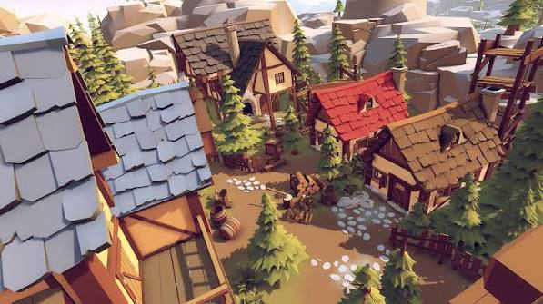
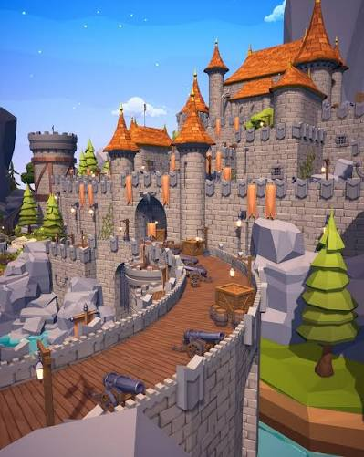

# Reference-derived 3D art direction

## Reference authority

**Reference A — village:** tightly composed timber-and-plaster cottages, large individually legible overlapping shingles, steep roof pitches, warm ochre earth, pale irregular stepping stones, dark timber fences, pine trees with irregular branch tiers, clustered domestic clutter, and large angular background rocks.

**Reference B — castle:** layered cool gray masonry, projecting stone blocks, cylindrical towers, steep orange tiled spires, gold finials, orange hanging banners, thick crenellated parapets, a plank approach with crates/barrels/cannons, angular rock terraces, and simplified tiered pines.

Use A for village architecture, planting, local density, and domestic paths. Use B for the castle, fortifications, stone construction, roof accents, and civic hierarchy. They differ in vegetation simplification and saturation: the shared rule is shaped, angular volumes with matte surfaces and strong light/shadow separation. Adopt A's richer pine outlines near the camera and B's simplified tiers at distance. Do not treat smooth toy primitives or faceted pyramids alone as sufficient fidelity.

The references show appearance, not construction dimensions, exact shader settings, polygon counts, or navigable layouts. All numerical ratios, colors, and budgets below are production interpretations; they are not measurements recovered from the images.

## Shape language

| Family | Required language | Avoid |
|---|---|---|
| Cottage body | Compact plaster panels enclosed by thick dark structural timber; readable front, side, and gable elevations; a strong stone ground course | A rounded box with decoration confined to its front |
| Village roof | Dominant steep gable; broad overhang; thick irregular lower silhouette; visible shingle overlaps and a restrained ridge cap | A thin colored triangular slab, perfect tile grids, a hip roof on every building |
| Roof variation | Red clay, slate blue, and golden weathered timber families; vary pitch, dormer location, eave shape, and chimney position | Per-house random palettes or only swapping roof color |
| Castle | Clear hierarchy of lower wall, round tower, taller keep, and steep spire; stepped cornices, corbels, chunky merlons | One tall extruded box surrounded by low cone caps |
| Pines | Visible trunk, tapering crown, 4–6 staggered branch masses in foreground assets; irregular angular skirts and asymmetric gaps | Three identical centered cones with the same taper everywhere |
| Bushes | Low grouped lobes with flattened undersides, uneven crown heights, and a few angular leaf planes | Uniform isolated spheres spread evenly over the map |
| Rocks | Squared fractured planes, broad flat faces, clipped corners, varied slabs; embed lower 10–20% into ground | Stretched identical icosahedra or disconnected floating stones |
| Timber props | Thick boards, tapered posts, simple joinery, a few broad wear marks | Tiny grooves and smooth rounded plastic edges |
| Paths | Warm compacted earth, soft broken edges, pale inset irregular stones in small groups | Solid pale gray circular ribbons with evenly spaced pebbles |

Cottage roof rise should visually approach 0.65–1.0 times its half-span, subject to review against existing collision and sightline limits. Roofs should carry roughly a third to nearly half of a small house's visible height. Reference B's tower spires should read tall: target rise 1.5–2.2 times their eave radius, not the current shallow caps. These are silhouette targets, not permission to enlarge building footprints or obstruct gates.

Keep the largest firs comparable to cottage ridges; use saplings at roughly half that height. Mature castle and keep remain the skyline anchor. Existing project landmarks preserve their distinctive motifs but should share the village's wood, stone, and construction language.

## Modeling language

- Spend triangles on contour breaks, bevels that catch the sun, shingle lips, arches, tree branches, and stone transitions.
- Use a single narrow bevel on important timber and stone edges. Do not uniformly subdivide every box. Silhouette bevel width should be about 1–3% of the component's short visible dimension; adjust by scale instead of scaling a heavily rounded unit cube nonuniformly.
- Use flat or deliberately split normals on rocks, roof chips, and branch masses. Use continuous normals on tower cylinders and barrel bodies, with hard boundaries at rims and joins. Avoid blanket smooth shading.
- Introduce controlled, seeded asymmetry: shingle width and edge offsets 5–12%, fence lean under about 4 degrees, crown offsets within 10% of width. Structural corners, sockets, and collision interfaces stay exact.
- Build reusable kits: cottage walls/gables/roofs/windows/chimneys; castle courses/arches/cornices/towers/parapets; timber posts/rails/planks; evergreen trunk/crown families; rock slabs and cluster bases.
- Repeat grammar rather than exact silhouettes. Three different crown profiles are more useful than many rotations of one cone stack.

## Material language

All common environment surfaces are matte. Initial roughness target is 0.85–1.0 for timber, plaster, foliage, earth, clay and stone. Metal can sit around 0.6–0.85 roughness; restrict exposed metal and highlights to bands, hinges, tools, and landmark machinery. These values need engine-side review under the existing tone mapping.

| Material family | Suggested palette anchors | Treatment |
|---|---|---|
| Plaster | `#E4C896`, `#E8D6B6`, muted warm pink | Broad warm planes; small value variation, no photo grain |
| Structural wood | `#51372D`, `#78503A`, `#A0784C` | Dark joints, broad flat boards, very restrained directional grain |
| Village clay / castle tile | `#AC4937`, `#C26743`, `#D48345` | Distinct tile groups, darker lips; castle can be warmer and brighter |
| Slate roof | `#677F90`, `#8FA6B4`, `#ADBCC2` | Cool planes balanced against warm walls |
| Timber shingle | `#8B673D`, `#A7834F`, `#B99C66` | Warm desaturated golden brown, irregular lower edges |
| Masonry | `#92929A`, `#ACA8A5`, `#C1BBB0` | Cool gray/violet shadow faces; restrained warm highlights |
| Earth / path | `#9F794D`, `#B59261` | Broad warm patches and compressed dirt; pale stones remain distinct |
| Foliage | `#4C6540`, `#728A43`, `#9CAB55` | Dark underside, mid olive body, sunlit yellow-green tips |

Use these as shared starting swatches, not independent material proliferation. Per-instance and vertex-color variation should normally stay within 5–12% of a family. Use geometry for visible stone courses and shingle outlines; use shader/texture variation for broad color shifts. Current procedural `onBeforeCompile` marks do not export into glTF: Blender approval must include material remapping in the runtime.

Avoid large emissive surfaces. Preserve Sandship power details and Wizard magic as small project identity accents. They should not compete with the castle or wash out material shading. Keep windows dark enough to establish depth; a modest warm interior is preferable to mirror-like green glazing across every house.

## World composition

The references have deliberate overlap and depth. A near roof/tree/fence frames the scene, houses and local props form the middle distance, and cliffs or the castle establish the rear silhouette. Density comes from clusters near building edges with open walking lanes between them.

Retain the current town plan and route centers. Break up their geometric regularity visually using irregular earth shoulders, staggered inset stones, interrupted planting clusters, and variation within plots. Do not move plots or redraw streets solely to imitate the reference camera.

Domestic cluster recipe: one cottage + one short fence return + one pine or two shrubs + 2–4 utility objects + a stepping-stone arrival. Place storage beside a wall, planting at a corner, and lanterns by the entrance. Avoid evenly distributing all categories everywhere.

Civic cluster recipe: stone tower or gate + projecting block courses + banner + attached rock terrace + grouped storage/ordnance outside the opening. The plank bridge/approach and cannons are reference-supported optional set pieces; adding them must not create an unsupported new traversable route or imply gameplay that does not exist.

Keep the hierarchy **castle silhouette → cottage roof rhythm → vegetation groups → props**. Project landmarks can be exceptions in form, but use the same footing, wood, stone, edge language, and surrounding plants. Keep background ridges less detailed and less contrasty than occupied streets.

## Lighting and acceptance views

Both references depend on readable directional sunlight, warm lit planes, cool shadow masses, and contact grounding. The current lighting is being edited independently; evaluate the final result before changing it again. Do not compensate for weak geometry by raising saturation or adding excessive ambient light.

Review under neutral material light, reference-like daylight, and the game's night/rain states. Use the gameplay camera plus a low oblique street view, not only isolated studio renders. Required compositions:

1. Village: three varied cottages, an irregular path junction, two pines, shrubs, fence, rocks, barrels and stacked timber.
2. Civic: castle gate and round tower, masonry parapet, tiled spires, banner, angular footing rocks and crates.
3. Integrated town: all five project landmarks visible among houses at 30 and 50 minutes, with mobile simplification and entrance clearance checked.

Acceptance requires matching the structural rules above, clear scale relationships, no floating/intersecting attachments, readable routes, and distinct but coherent silhouettes. No asset receives artistic approval until these views can actually be inspected.
