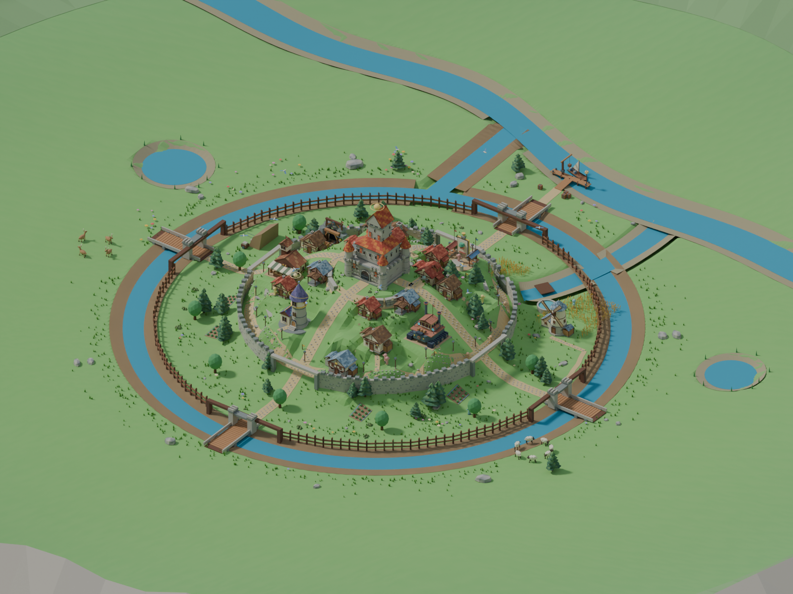
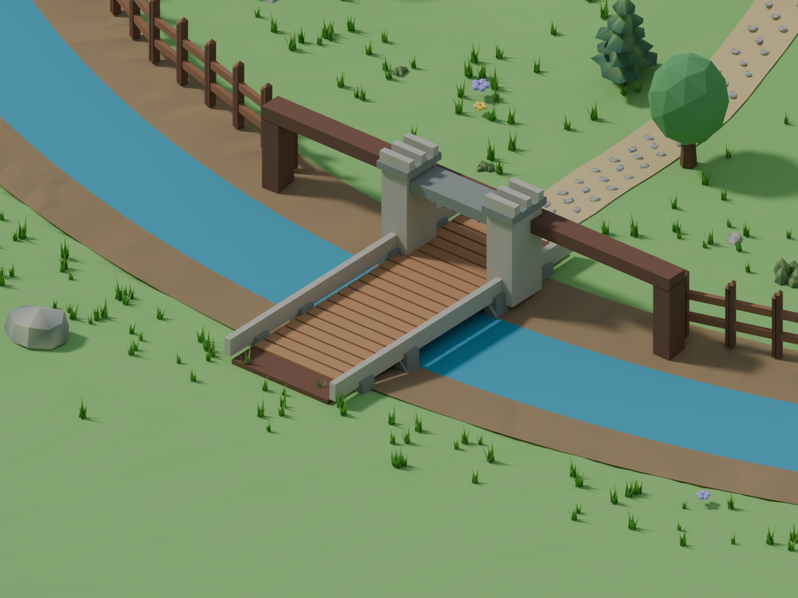

# River-fed castle moat

Windmill level 2 excavates and fills a channel around the castle hill, outside
both existing town walls. A graded feeder joins the main river to the northwest;
the mill channel also joins the moat instead of leaving banks across its water.
The terrain bed is actually lowered as water rises, and restores on restart.

Roads level 2 supplies four bridges aligned with the cardinal roads. Roads MAX
adds stone gatehouses with raised portcullises. These entrances do not alter the
existing wall-gate commitment: a previously sealed wall still blocks supplies.
Buildings, hill shelves, main river shipping and the port keep their locations.

The channel and crossings are generated in `castle-moat.ts`; their conditions,
layout and crew collision bounds are in `moat-layout.ts`. Crossing meshes are
batched by material. Temporary geometry and the water material are owned by the
moat; shared town materials are retained. Saved games, skip and reduced motion
apply completed water levels immediately.

Validation covers progression thresholds, water depth, plot clearance, dry
crossings, sealed walls, restart, shared-resource disposal, and independent
mill/moat terrain updates in desktop and mobile detail tiers. Blender reviews
use exported runtime geometry, not browser screenshots.

Reproduce with `node --import tsx scripts/export-town-review.mjs --game --moat`
and run `art/blender/review_moat.py` through Blender MCP.
