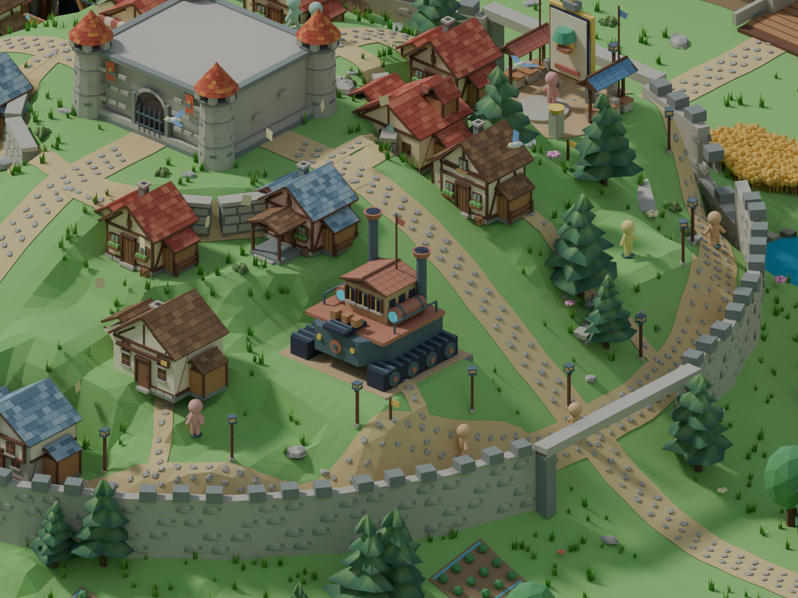

# Roads on the castle hill

The road ribbons previously sampled the smooth height function only along their
edges. The rendered terrain uses a triangulated grid, so these surfaces could
intersect: the diagnostic found road triangle centers up to 1.40 world units
below the desktop terrain and 0.65 units above the mobile terrain.

Road footprints now split at the rendered terrain's cell boundaries and triangle
diagonals. Every road face follows a single ground face, about 0.048 units above
it. Junction layers receive millimetre offsets to avoid coincident faces. The
terrain and road sampler share the grid detail settings. Paving stones align
their local up axis to the ground normal, then apply their existing random yaw.

The mill approach uses the natural terrain before the channel opens and rebuilds
against the carved terrain when the mill develops. Existing road centerlines,
widths, gates and progression thresholds remain the same.

Regression tests raycast against the actual Environment terrain, sampling inside
road faces across spokes, both inner rings and building approaches. They cover
both detail settings and the dry/working mill channel, ring closure and paving
orientation. The corrected face clearance is within 0.0002 units of its target.

Blender review of runtime geometry (not a browser screenshot):

Reproduce with `node --import tsx scripts/export-town-review.mjs --game --roads`,
then run `art/blender/review_roads.py` through Blender MCP.
