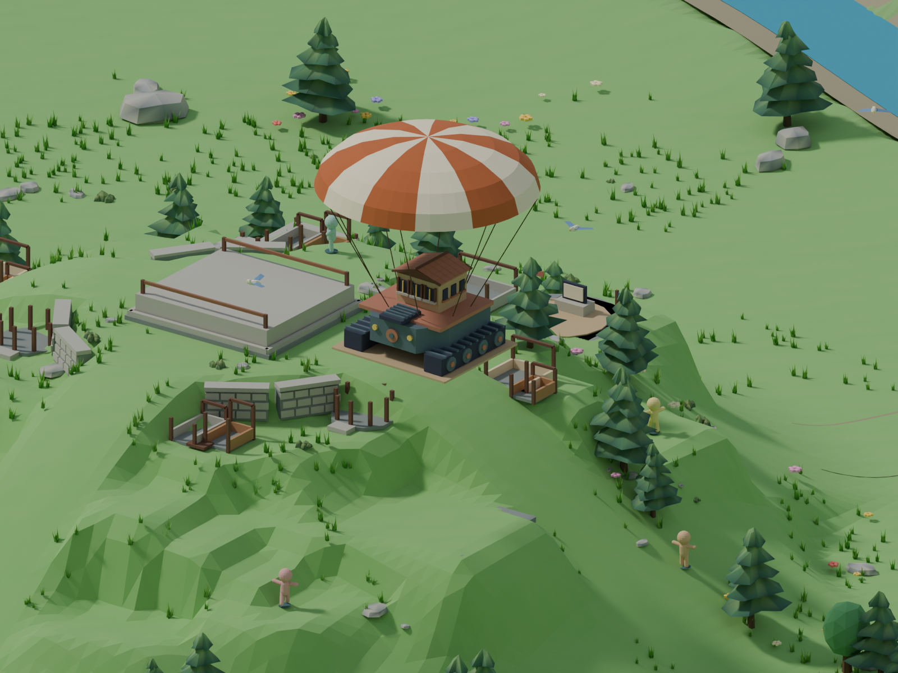

# Sandship parachute arrival

Choosing Workshop for the first time brings Sandship down on a cream-and-copper
striped parachute. Its starter hull is visible at level 1, with the stone dock
already grounded. The camera frames the airspace above its existing hillside plot.

The sequence lasts 7.2 seconds: about 5.9 seconds of gently swaying descent, then
the released canopy drifts aside and fades. Later Workshop upgrades retain the
usual construction sequence. Skip, restart, and loading a save settle or remove
the arrival immediately; reduced motion uses the finished placement.

The ship reuses its existing Blender-authored stage-3 hull in both quality tiers.
The animated canopy and suspension lines are procedural Three.js geometry, owned
and disposed by `ParachuteArrival`. Shared ship geometry and materials survive
cleanup. The stone footing remains outside the moving payload.

Validation: `npm run check` and `npm run build`; live-browser completion and skip
checks; Blender render of exported runtime geometry. Browser screenshots were
unavailable, so the image below is a Blender composition review, not a browser
capture.

Reproduce the render with `node --import tsx scripts/export-town-review.mjs --game
--parachute`, then run `art/blender/review_parachute.py` through Blender MCP.
