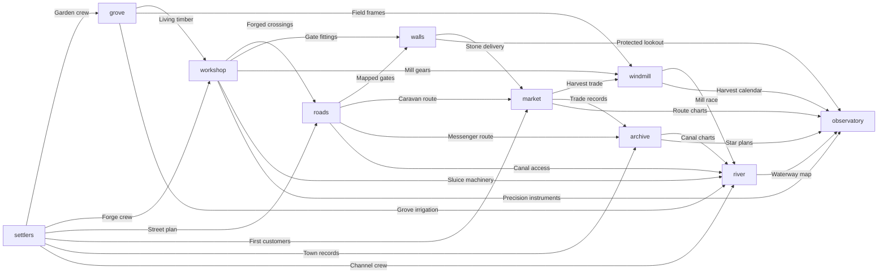

# Town order puzzle: current rules

The player chooses each of ten ideas once. A choice places that idea at level 1. Every pair listed below has a one-time joint project. When the second partner arrives in the route's expected order, both partners gain their assigned stages. Reversing the pair misses that project permanently for this run. Other pairs can still advance either idea. Every idea receives seven stages from all its projects combined, so an all-project route reaches level 8 in every idea (80/80).

The first card chooses the route. Archive first selects Storybook Night; any other first card selects the valley route. The two full solutions are:

- Valley: Settlers → Grove → Workshop → Roads → Walls → Market → Windmill → Archive → River → Observatory.
- Storybook Night: Archive → Observatory → River → Grove → Settlers → Workshop → Windmill → Roads → Market → Walls.

The route establishes the expected direction of every project edge. For instance, valley gates need Roads before Walls; a route that places Walls before Roads has already committed the wall's layout and cannot build the **Mapped gates** project later. Both Walls and Roads miss the stages awarded by that project, but both can grow through their remaining collaborations. The Storybook route starts from the Archive's plans and has its own expected order for the same project graph.

The arrows show the valley route direction for all 28 collaborations. The complete payoff copy is in `src/town/action-rules.ts`. This graph is a design aid; `src/town/game.ts` is the playable rule interpreter. The game reports each missed project after a choice and lists all misses at the end.

A valid project advances both partners at once. It never upgrades unselected ideas. Event waves keep the partner's existing level visible before each new stage, and skip/reload resolve to the same final state. The **Mapped gates** project also opens the physical wall gates; reversing Roads and Walls leaves them closed. The v2 save key separates these rules from earlier saved runs.
