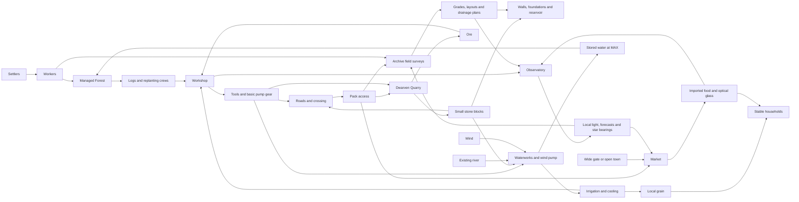
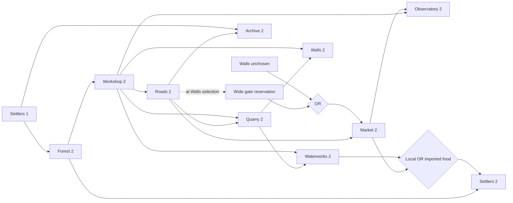
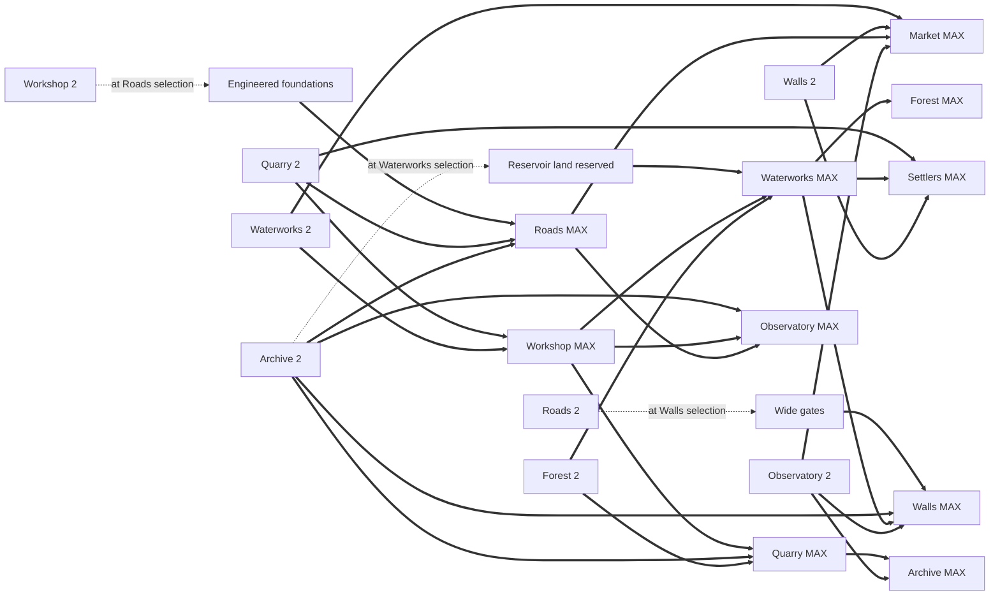
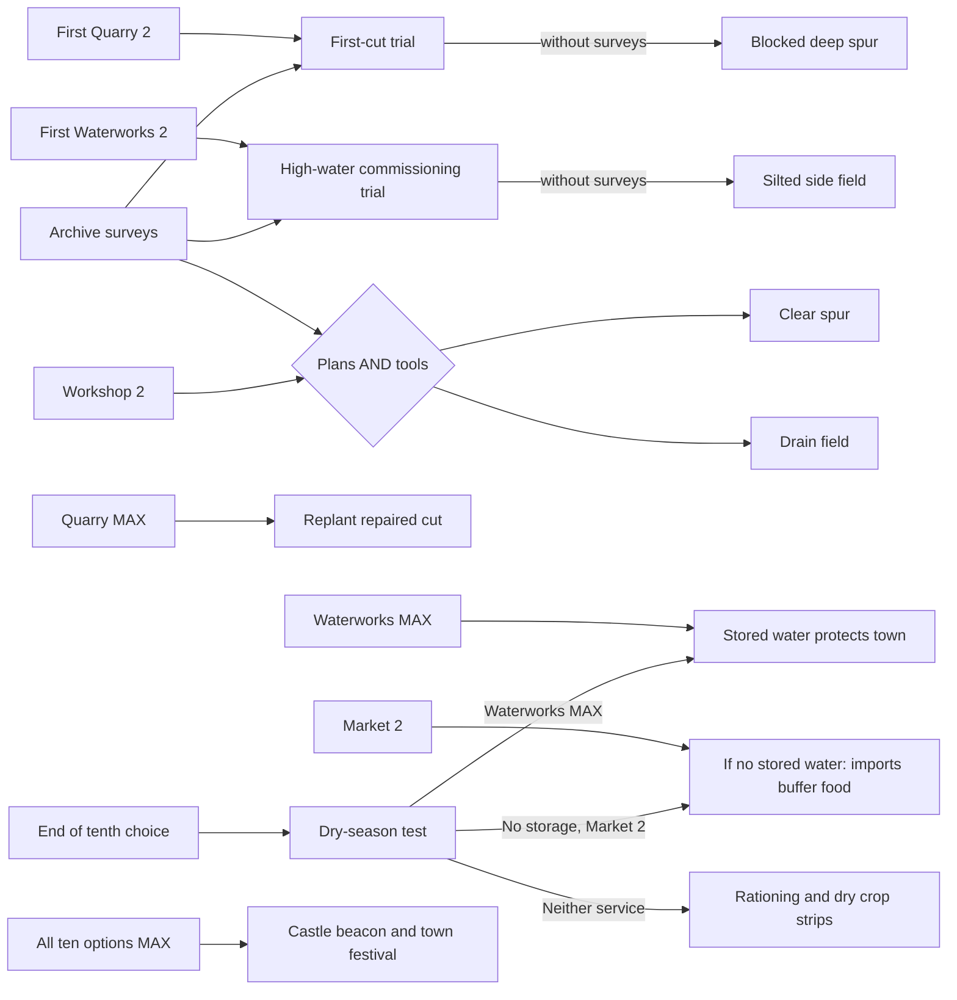

# Living Town — an ecosystem you can learn

**Complete progression redesign · 25 September 2026 · proposed rules v1**

The playable nine-choice game's [current progression rules](current-progression.md) now retry blocked upgrades after every choice. The ten-choice proposal below remains separate.

This is a design specification and executable rules prototype for the proposed ten-choice game. The companion [simulator](town-progression-simulator.mjs) and [generated validation report](town-progression-validation.json) are the authority for those proposed numeric rules. The playable build still uses nine choices. Its [castle-hill presentation](../art-direction/castle-mount-production.md) and [wildlife and river-port progression](../art-direction/living-world-production.md) have since been implemented as world reactions to those existing choices.

**Recommendation:** use ten choices, add a real Quarry, turn Windmill into Waterworks & Mill, and make the Archive and Observatory useful services. Preserve three lasting construction decisions. Let missing workers, materials, food and equipment arrive later. Tell the story through deliveries, construction and changes in the landscape.

The player is designing **one construction season**. Selecting a choice starts its permanent site; it does not mean instantly completing its operation. There is no demolition or relocation within this short run. That convention explains lasting foundations and land reservations; it must be stated before play.

Three GPT-6 Sol High specialists independently explored progression, economy/events, and visual/replay design. The lead synthesis retained their resource delivery and recovery ideas, rejected permanent incompetence for early Archives, rejected a hydro-powered windmill, and separated Observatory development from the all-town victory condition. A specialist then checked the combined rules and both ending routes.

## 1. Design diagnosis

### What is already strong

- Nine single-use choices make a readable, short GROW-style puzzle. The deterministic save/replay model fits discovery across runs.
- Later choices already improve earlier buildings. The mill, fields and grove demonstrate a satisfying connection between a building and its surroundings.
- The three authored building forms give upgrades more substance than badges or counters.
- Gates are a good example of a physical construction commitment. A road ending at masonry communicates a problem immediately.
- The five real portfolio projects have distinct silhouettes and remain meaningful destinations during exploration.

### What is currently arbitrary or underused

- The predecessor chain is almost one long password. Most failed level-2 checks are permanent even when the missing input is something deliverable, such as tools or timber.
- Grove supplies a prerequisite, but timber never has to travel. Workshop supplies another flag, rather than recognizable products. Stone has no source at all.
- Roads controls the Dwarves landmark without explaining its economy. The map's existing main river is outside town; the small planked bridge crosses a branch channel. Describing the main river as splitting the settlement is misleading.
- Market enables the mill by fiat. Imported specialist goods should have a clear use; local machinery should not depend on a caravan solely to extend the chain.
- Windmill simultaneously implies machinery, irrigation, agriculture and stream creation. The river already exists. Wind turns its sails; a visible mechanism must explain pumping.
- Archive arrives too late to plan the water and defenses it ought to improve. Founding an Archive early should not make its citizens permanently unable to learn engineering.
- Observatory is effectively a final completion check. A functioning lens and signal tower should provide weather information and useful lighting before victory.
- Walls currently conflate enclosure, transport and protection. A person-sized wicket, a wagon gate, a drainage culvert and a watchtower are different things.
- The secret is an exact order check. Its source pages are also disconnected from normal Archive visual state. It needs ingredients the player can see and understand.

### Keep, change, reject

| Keep | Redesign | Reject for this version |
|---|---|---|
| One choice per site; levels 0/1/2/3 | Most operational prerequisites become recoverable | Ten permanent level-1 traps |
| Forestry → tools → transport | Physical deliveries distinguish resource sources from consumers | Numerical inventory, prices, worker micromanagement |
| Planning gates before enclosure | Three explicit foundation/land commitments | Random catastrophes, real-time deadlines |
| Irrigation improves crops and nature | Water intake, lift pump, reservoir and drainage become separate visible parts | A large dam that appears to create the river |
| Distinct secret, MAX and ordinary endings | Secret depends on town state and recorded folklore | An exact secret button sequence |
| Existing landmark identities | Dwarves own quarrying; Wizard supplies light and weather signals | Portfolios portrayed as changing real-world project status |

Adding Quarry earns the tenth slot because it supplies both an observable material and a major retroactive building wave. Waterworks & Mill stays one choice because its pump, reservoir and fields form one coherent service district. Keep Archive separate from Observatory: engineering surveys and magical light solve different problems.

## 2. Final option roster

Player names below are final recommendations. Internal IDs are included only for implementation. Levels describe permanent structural development; temporary weather and repair overlays are separate. Every click immediately creates level 1, even when work cannot yet proceed.

### 1 — Settlers (`settlers`)

| Field | Specification |
|---|---|
| Fantasy | Establish a community that will build and inhabit the town. |
| Role | Provides labor, household demand and an organized civic population. Every specialist crew can pitch its own temporary shelter, but permanent operation needs settled workers. |
| Produces | Workers at level 1; stable households at level 2; organized neighborhood and refuge activity at MAX. Labor is a shared capability, not a spendable pool. |
| Consumes | Timber and dependable food; stone, stored water and defenses for its fullest form. |
| Level 1 | Cabins, camp kitchen, seven residents, a chalk practice ring at Battle Cards. Workers already enable forestry and other later services. |
| Level 2 | Timber houses, thirteen residents and full grain racks when either local crops or imported food arrive. Battle Cards becomes a busy assembly/training yard. |
| MAX | Stone homes, twenty-two residents, planted courtyards and a neighborhood tournament. Stored water and working defenses allow a permanent, secure population. |
| Early consequence | A useful opening, but little activity beyond camp work until food and timber services exist. No punishment for settling first. |
| Late consequence | Previously placed crews and sites wait visibly. Arrival can start forestry, tools and several other services in one wave. |
| Retroactive upgrades | Starts managed forestry; indirectly staffs tools, surveys, transport and town operation. Later Waterworks, Market, Quarry and Walls improve the homes. |

### 2 — Managed Forest (`forest`)

| Field | Specification |
|---|---|
| Fantasy | Care for an existing woodland and plant the next generation. |
| Role | Sustainable timber, orchards, erosion control and habitat. This is not instant maturation of brand-new saplings. |
| Produces | Timber and replanting crews at level 2; irrigated park/orchard habitat at MAX. |
| Consumes | Settled workers; reliable stored irrigation for year-round flourishing. |
| Level 1 | Forester shelter, protected existing trees, new saplings and marked coppice rows. No workers means no harvesting yet. |
| Level 2 | Selective cutting, stacked logs, seedlings beside stumps and a small orchard. Logs travel by shoulder or handcart before developed roads. |
| MAX | Reservoir-fed trees bloom, orchard paths open and birds nest. Streams visibly reach roots. |
| Early consequence | Before Settlers, the marked woodland waits; it can recover fully when workers arrive. No permanent wild-thicket penalty. |
| Late consequence | Workshop and downstream tools wait. When tended, its first timber delivery can awaken multiple sites. |
| Retroactive upgrades | Operates Workshop, supplies Quarry reclamation and maintains the reservoir's vegetated catchment. Waterworks MAX transforms the existing woodland into the park. |

### 3 — Workshop (`workshop`)

| Field | Specification |
|---|---|
| Fantasy | Give the smiths and carpenters a place to make things. |
| Role | Converts materials into visible useful equipment. |
| Produces | Hand tools, timber trestles, repair fittings and basic pump gear at level 2; precision machinery, quarry pumps and instrument mounts at MAX. |
| Consumes | Managed timber; locally quarried ore and water for cooling/heavy work. |
| Level 1 | Repair shed, portable anvil, gear template and Sandship maintenance scaffold. The arriving smith brings a finite kit of existing tools and iron fittings. |
| Level 2 | Sawbench and forge operate. Bridge joints, handcarts and a wooden pump mechanism leave on real routes. Initial tools use the smith's kit; sustained heavy production needs Quarry ore. |
| MAX | Water troughs, foundry crane and machine yard. Sandship's industrial fittings operate; precision telescope mounts and mine pumps are delivered. |
| Early consequence | A repair shed waits for managed timber. It is not permanently bad because it was built early. |
| Late consequence | Roads and extraction wait for proper tools; early Roads may already have committed to a small crossing. |
| Retroactive upgrades | Starts Roads and Quarry work, equips Waterworks, improves Observatory, and retrofits gates. Stone/ore plus water later expands the original shed. |

### 4 — Roads & Crossing (`roads`)

| Field | Specification |
|---|---|
| Fantasy | Connect the settlement, foothill quarry, outside mill and trade approach. |
| Role | A transport network with either pack-scale or wagon-scale carrying capacity. |
| Produces | Mapped access and pack routes at level 2; paved heavy transport and a protected lamp conduit at MAX. |
| Consumes | Workshop tools; stone and Archive surveys for heavy infrastructure. |
| Level 1 | Paths and route pegs appear immediately. If tools already exist, broad bridge foundations and conduit sockets are reserved. Otherwise workers commit to a narrow packbridge footing. |
| Level 2 | Tools complete the timber crossing and connected routes. Pack animals and small handcarts can travel in either layout. The branch-channel bridge can exist over a dry future channel. |
| MAX | Only engineered foundations can support the stone crossing, wagon surface, drainage and fixed conduit. Quarry stone and surveys complete them. |
| Early consequence | Without a working Workshop at selection, the narrow bridge remains a permanent capacity limit; Roads caps at 2. Its later operation remains useful. |
| Late consequence | Quarry, surveys and trade wait. Walls erected before these routes reserve only a small wicket. |
| Retroactive upgrades | Enables Quarry extraction, Archive fieldwork and Market access. Stone paves existing routes; later Observatory lights follow the conduit. |

### 5 — Dwarven Quarry (`quarry`)

| Field | Specification |
|---|---|
| Fantasy | Open a stone and ore cut in the nearby foothill, managed by the dwarven guild. |
| Role | Supplies the missing physical source of durable construction materials. |
| Produces | Small dressed-stone blocks and ore at level 2; a safely drained, terraced extraction operation at MAX. |
| Consumes | Tools and pack access; surveys, precision pumps and forestry crews for safe full development. |
| Level 1 | Prospecting flags at a real outer rock face, idle handcart, guild sample table and visible ore seam. |
| Level 2 | Handcarts bring small blocks and ore to the Dwarves depot. A first-cut safety trial tests whether surveys exist. A slip blocks the deeper spur, while safe surface extraction continues. |
| MAX | Pumps drain the cut, terraces stabilize the face, replanted edges cover spoil, and a guild hoist runs. On narrow roads, exports stay on small carts; large wagons require Roads MAX. |
| Early consequence | Before tools/access, it waits. Starting extraction before surveys causes a recoverable slip rather than permanently deleting stone production. |
| Late consequence | Stone construction and heavy machinery wait; arrival can upgrade roads, walls and foundations together. |
| Retroactive upgrades | Upgrades Workshop metallurgy, Roads materials, Walls, Waterworks foundations and homes. Archive and Workshop later stabilize the mine. |

### 6 — Archive & Surveyors (`archive`)

| Field | Specification |
|---|---|
| Fantasy | Collect local knowledge, walk the routes and put useful plans in builders' hands. |
| Role | Civil engineering, geological records and coordination. |
| Produces | Surveys and blueprint deliveries at level 2; an illustrated town atlas at MAX. If founded before mapped access, also preserves an illustrated folklore collection. |
| Consumes | Settlers and working routes for field surveys; a fully surveyed quarry plus astronomical measurements for the complete atlas. |
| Level 1 | Shelves, drawing table and blank map. Before developed roads, its first folios depict walking tales and local animals; after roads, they depict measured street plans. |
| Level 2 | Surveyors walk routes; height stakes, drainage arrows, quarry markings and blueprints appear at consumers. Both kinds of Archive can become competent engineers. |
| MAX | Bound relief atlas includes underground sections and star bearings. District signs and survey monuments become permanent. Earlier folk illustrations remain available. |
| Early consequence | It waits for field access and collects folklore in the meantime. This is a bonus identity, not a permanent planning penalty. |
| Late consequence | Early extraction may slip; an already committed Waterworks site may lack reservoir space. Plans repair damage but cannot retroactively reserve occupied land. |
| Retroactive upgrades | Completes engineered Roads; makes Quarry safe; repairs water overflow; prepares reservoir placement; organizes defenses and Observatory relays. Quarry and Observatory complete its atlas. |

### 7 — Waterworks & Mill (`waterworks`)

| Field | Specification |
|---|---|
| Fantasy | Bring river water to fields, lift it to a header pond and store enough for dry weather. |
| Role | Irrigation, local food, industrial cooling and stored emergency water. |
| Produces | Running irrigation, grain and cooling water at level 2; dependable stored supply at MAX. |
| Consumes | Workshop equipment and small quarry blocks. A survey must exist before selection to reserve the large basin site. Precision equipment and managed catchment complete storage. |
| Level 1 | Mill, dry feeder/channel stakes and small grain plot. With existing surveys, the basin outline is visibly reserved above the fields. Without them, fields and channels occupy that space: a run-of-river layout. |
| Level 2 | Intake opens; a gravity feeder reaches a low sump. The windmill turns a geared lift pump into a small header pond; channels feed green crop strips and cooling troughs. With surveys, a separate overflow bypass returns high water safely to the river even without a reservoir. A clutch can drive grain milling. The hydraulic trial tests drainage planning. |
| MAX | Reserved basin becomes a stone-lined reservoir with spillway, pressure controls, full wheat fields, reeds and a pond edge. Stored water keeps the town green through the dry season. |
| Early consequence | Before an active Archive survey, basin space is not reserved. Tools can later operate the system and plans can repair flooding, but it caps at 2 this run. |
| Late consequence | Food imports can support households, but local crops and heavy machinery wait. The first water release creates a town-wide reaction. |
| Retroactive upgrades | Cools Workshop, supports Quarry pumps, feeds households, blooms Forest and supplies defensive refuges. Workshop MAX later completes reservoir controls. |

### 8 — Gates & Walls (`walls`)

| Field | Specification |
|---|---|
| Fantasy | Protect the town while keeping its entrances and waterways working. |
| Role | Refuge, watches, secure stores and safe access through the enclosure. |
| Produces | Shelter/security at level 2; a lit, watered defensive district at MAX. Gate capacity is a separate persistent property. |
| Consumes | Quarry stone and Workshop hardware; surveys, stored water and local signal lights for MAX. |
| Level 1 | Timber enclosure rises. Existing developed routes reserve wide gate openings. Without them, it has only a small pedestrian/handcart wicket, not an invisible or completely inescapable wall. |
| Level 2 | Stone facing, watch posts and proper gate hardware. A wicket layout remains too narrow for a commercial caravan. Residents and small material handcarts still fit. |
| MAX | With wide gates, plans, reservoir supply and Observatory signals: accessible outer refuge, cistern-fed emergency points, signal stones and properly modeled water culverts. |
| Early consequence | Selecting before Roads level 2 fixes a narrow entrance layout. It can become a useful stone refuge but never a full trade-and-defense district. |
| Late consequence | The town remains open to trade, but lacks protected storehouses and developed refuges; Settlers/Market cannot reach MAX yet. No spontaneous raider penalty is added. |
| Retroactive upgrades | Provides the security that matures homes and trade. Quarry changes timber to stone; Waterworks and Observatory later complete the defensive network. |

### 9 — Market (`market`)

| Field | Specification |
|---|---|
| Fantasy | Welcome traders and exchange the town's surplus. |
| Role | Imported food and specialist glass; later a secure night trading hub. |
| Produces | Imported provisions, optical glass and visitors at level 2; local-food trade and large night caravans at MAX. |
| Consumes | Working routes and an entrance that admits trade. Local food, defenses, heavy roads and tower light complete it. |
| Level 1 | Two barter stalls, blankets and the Outpost exchange awning. Without a route, traders wait at the approach; without a wide gate, their grouped caravan cannot unload inside. |
| Level 2 | Pack caravans bring grain and a conspicuous telescope-glass crate. Homes can grow before local irrigation. |
| MAX | Paved trading hall, guarded grain stores, moving wagons and night stalls. The tavern is supplied by the same route. |
| Early consequence | Local barter starts immediately; missing routes can arrive later. A previously committed wicket wall remains a trade bottleneck. |
| Late consequence | The town may eat local grain, but Observatory waits for specialist glass and no night trading develops. |
| Retroactive upgrades | Feeds homes and supplies the Observatory lens. Roads, Waterworks, Walls and local tower light later transform existing stalls. |

### 10 — Observatory (`observatory`)

| Field | Specification |
|---|---|
| Fantasy | Build an instrument tower that reads the sky and lends its light to the town. |
| Role | Weather information, local lighting, night navigation and a distributed light relay. |
| Produces | Forecast flag, astronomical measurements and local magical lamps at level 2; reliable town-wide light distribution at MAX. |
| Consumes | Workshop fittings and imported glass; civil surveys, precision mount and engineered road conduit for MAX. |
| Level 1 | Telescope platform, weather vane and lens-shaped empty frame. It is a working construction site, not a mysterious failure. |
| Level 2 | Lens aligns, forecast flag rises, and nearby public lamps—including Market and gate signal lamps—light locally. Weather information is available even before town completion. |
| MAX | Precision mount, surveyed relay angles and protected conduit distribute steady light across the full road network. It can reach MAX before the whole town does. |
| Early consequence | Waits for tools and glass, then activates automatically. It never acquires a permanent curse from being selected early. |
| Late consequence | Trade and maps can still develop, but local night life and complete atlas measurements wait. |
| Retroactive upgrades | Completes the atlas, lights Market and defensive signals, then activates the road light network. The separate all-town condition lights the final castle beacon. |

## 3. Resource ecosystem

Resources are **capabilities with physical evidence**, not balances to spend. A prerequisite means the service can supply ongoing work; it is never silently consumed by one of several competing consumers. Decorative supply props are not authoritative game state.



**Bootstrap is explicit.** The smith arrives with portable tools and a small stock of fittings; those cannot sustain a heavy machine yard. The forest includes standing trees. Early builders carry modest loads. Quarry level 2 exports blocks small enough for handcarts, including through the wicket. Trade caravans need a proper gate to bring animals and grouped loads through safely. Large wagons and the engineered bridge are a later efficiency/scale upgrade, not prerequisites for all stone to exist.

**Water has a physical source and path.** The proposed authored route is river intake → gently descending feeder → low mill sump → wind-driven lift pump → header pond → descending irrigation and return drainage. Reservoir storage is off-channel and only added on reserved ground. Before production, verify the feeder's elevation and return outfall; do not assume the present spline already satisfies them. Wind drives the pump and grain machinery; flowing river water never drives the sails.

## 4. Complete dependency graph

Notation: **solid arrows** are operational/material dependencies; **dashed arrows** are construction commitments captured at selection; **thick arrows** are retroactive MAX reactions. All incoming arrows to a level node are AND unless an explicit OR node is shown. Every MAX also requires that option's own level 2. Nodes can satisfy later predicates with level 3; `2` means `>=2`.

### Operation and supply access



### Full development and retroactive reactions



### Environment, repairs and victory



Trial branches are conditional outcomes, not extra construction requirements. The exact predicates and precedence are below. Forecasts reveal and explain these tests; they do not secretly alter their dates or RNG.

## 5. Exact progression rules

### Shared semantics

`S,F,W,R,Q,A,H,G,M,O` mean Settlers, Forest, Workshop, Roads, Quarry, Archive, Waterworks, Gates & Walls, Market, Observatory. Comparisons in the table refer to levels. Every rule is also gated by the target being chosen; every MAX requires the target already at level 2.

| Choice | At selection, before new reactions | Recoverable level 2 | MAX, in addition to own level 2 |
|---|---|---|---|
| S | Create camp at 1 | `F>=2 AND (H>=2 OR M>=2)` | `Q>=2 AND H=3 AND G>=2` |
| F | Create marked woodland at 1 | `S>=1` | `H=3` |
| W | Create repair shed at 1 | `F>=2` | `Q>=2 AND H>=2` |
| R | Create paths at 1; `engineeredRoads = (W>=2)` | `W>=2` | `engineeredRoads AND Q>=2 AND A>=2` |
| Q | Create prospect at 1 | `W>=2 AND R>=2` | `W=3 AND A>=2 AND F>=2` |
| A | Create records post at 1; `folklore = (R<2)` | `S>=1 AND R>=2` | `Q=3 AND O>=2` |
| H | Create dry waterworks at 1; `reservoirReserved = (A>=2)` | `W>=2 AND Q>=2` | `reservoirReserved AND W=3 AND F>=2` |
| G | Create palisade at 1; `wideGates = (R>=2)` | `Q>=2 AND W>=2` | `wideGates AND A>=2 AND H=3 AND O>=2` |
| M | Create barter stalls at 1 | `R>=2 AND (G=0 OR wideGates)` | `H>=2 AND G>=2 AND R=3 AND O>=2` |
| O | Create instrument platform at 1 | `W>=2 AND M>=2` | `A>=2 AND W=3 AND R=3` |

Only three booleans limit MAX; `folklore` is a retained collection, not an engineering restriction. Selecting an early Workshop, Quarry, Market, Archive or Observatory does not lock its level.

```text
CHOOSE(option):
  reject unknown, repeated, or eleventh choice
  previous = fully settled state from previous turn
  capture this option's layout/folklore flag using previous only
  add option to order and set its level to 1
  record its local arrival reaction

  repeat:
    evaluate all chosen options' level-2 rules
    evaluate all chosen options' MAX rules
    raise eligible levels; never lower them
  until no level changes

  if Quarry has reached 2 for the first time:
    first-cut outcome = protected if Archive >=2, otherwise slipped
  if Waterworks has reached 2 for the first time:
    high-water outcome = protected if Archive >=2, otherwise overtopped
  derive repairs from settled capabilities:
    slipped + Archive >=2 + Workshop >=2 -> deep spur repaired
    repaired deep spur + Quarry =3 -> reclaimed
    overtopped + Archive >=2 + Workshop >=2 -> drainage repaired

  if all ten selected:
    dry-season outcome = protected if Waterworks =3
                         else buffered if Market >=2
                         else shortage
    evaluate Storybook Night predicate
    perfect = every level is 3

  derive final snapshot and causal visual events
  save committed order; render causal events, then final snapshot
```

All trial eligibility is assessed **after** the turn's closure, not halfway through a loop. If a newly supplied Workshop starts both Roads and a prebuilt Archive, the surveyors can mark the cut before the prebuilt Quarry starts digging. Animate the plans before that first cut. Layout flags cannot benefit from this same-turn rescue: their footing/land reservation was captured before the new selection.

**Monotonicity and limits.** There are at most 30 increases from 0 through 3 across ten options. Trial scars never remove levels or withdraw basic output. A slipped quarry keeps safe surface extraction; an overflowing side field does not destroy the whole food supply. This prevents repair loops and resource deadlocks. Local level 3 means the fullest permanent form; a weather overlay can temporarily ration activity. An all-MAX town has stored water and therefore also passes the final dry season.

**Supply consistency.** A narrow wicket permits people and small stone/ore handcarts. It does not admit the Market's pack caravan as a safe grouped delivery. Market's gate predicate is separate from Walls level. There is no retroactive loss of trade: if Market already operates, Roads was already developed, so Walls selected afterward automatically reserves wide gates.

## 6. Validated all-MAX solution

**Settlers → Managed Forest → Workshop → Roads & Crossing → Archive & Surveyors → Dwarven Quarry → Waterworks & Mill → Gates & Walls → Market → Observatory.**

Level vector order is **S F W R Q A H G M O**. A newly selected option may pass through 1 and 2 on its way to its listed settled level; the visuals still show the local arrival.

| Turn | Chosen → settled level | Complete level vector | Automatic reactions and environmental changes |
|---|---|---|---|
| 1 | Settlers → 1 | `1 0 0 0 0 0 0 0 0 0` | Camp, workers and chalk assembly ring appear. |
| 2 | Forest → 2 | `1 2 0 0 0 0 0 0 0 0` | Workers tend standing woodland; first logs are stacked. |
| 3 | Workshop → 2 | `1 2 2 0 0 0 0 0 0 0` | Timber delivery starts sawbench, forge and bridge fittings. |
| 4 | Roads → 2 | `1 2 2 2 0 0 0 0 0 0` | Working tools reserve engineered footings, finish a timber crossing and map routes. |
| 5 | Archive → 2 | `1 2 2 2 0 2 0 0 0 0` | Field survey stakes mark grades, safe quarry terraces and reservoir ground. |
| 6 | Quarry → 2 | `1 2 2 3 2 2 0 0 0 0` | Surveyed first cut passes. Stone carts start; Roads becomes MAX with pavement, heavy crossing and unlit conduit fixtures. |
| 7 | Waterworks → MAX | `2 3 3 3 3 2 3 0 0 0` | Basin was reserved at selection. Waterworks reaches 2; high-water trial passes. Cooling upgrades Workshop; precision pumps and plans upgrade Quarry; reservoir controls complete Waterworks; Forest blooms and Settlers become 2. |
| 8 | Walls → 2 | `3 3 3 3 3 2 3 2 0 0` | Routes reserve wide gates. Stone defenses develop; stored water and protection upgrade Settlers to MAX. Watch signal fittings wait for light. |
| 9 | Market → 2 | `3 3 3 3 3 2 3 2 2 0` | Gate admits traders; grain and optical glass arrive. Night-trade stalls wait for illumination. |
| 10 | Observatory → MAX | `3 3 3 3 3 3 3 3 3 3` | Lens activates local lights; Archive, Walls and Market reach MAX. Precision mount and conduit make Observatory MAX. Reservoir passes dry season; all ten unlock the castle beacon. |

This is not the only good order. The separately tested **S → F → W → R → M → O → A → Q → H → G** activates Observatory level 2 on **turn 6**, reveals later weather information, lights local activity, and still finishes at ten MAX. A Quarry slip can also be repaired and reclaimed on an eventual all-MAX route; perfect development does not erase the record of how the town got there.

## 7. Interesting wrong orders and recoveries

All sequences below are fully simulated. Use the same **S F W R Q A H G M O** vector convention. They are examples of recognizable town identities, not additional rule exceptions.

| What the player did | Exact complete example | Final levels / outcome | Lasting or recoverable difference; physical reason |
|---|---|---|---|
| Built Roads before tools | `S F R W A Q H G M O` | `3 3 3 2 3 3 3 3 2 2`; 7 MAX | Narrow packbridge, small caravans, local lamps. The footings cannot carry heavy wagons or fixed conduit. Tools later make the crossing useful, but do not relocate its foundations. Without the early illustrated folios this is an ordinary Lantern Village, not Storybook Night. |
| Claimed Waterworks land before surveys | `S F W R H Q A G M O` | `2 2 3 3 3 3 2 2 3 3`; 6 MAX | Initial overflow is repaired; broad reservoir space is already occupied by channels and fields. The final dry season browns crop edges and trade supplies imported food. It is a prosperous trading town with seasonal water limits. |
| Enclosed the town before its routes developed | `S F W G R A Q H M O` | `3 3 3 3 3 2 3 2 1 1`; 6 MAX | Stone refuge, good local food and small material deliveries; caravan waits outside the wicket. No imported optical glass means the Observatory remains a platform. Safe, inward-looking fortress rather than a dead town. |
| Started the quarry before the Archive | `S F W R Q A H G M O` | All 3; first-cut slip later reclaimed | The unsafe deep cut leaves fallen stone and a crooked rail. Archive surveys mark a safe terrace; tools clear the spur; later pumps and planting reclaim it. A subtle geological scar remains as history. This mistake is recoverable. |
| Built the Observatory before its suppliers | `O S F W R A Q H G M` | All 3; tower waits until the final Market | A bright lens outline and covered instrument wait in a scaffolding platform. The glass crate eventually arrives and a late light wave completes the town. This is delayed gratification, not a hidden permanent penalty. |
| Started trade before local farming | `S F W R M O A Q H G` | All 3; Observatory operates on turn 6 | Imported grain develops households; glass enables local lamps. Stores show sacks from outside before they show local wheat. A valid commercial-first variant of the solution. |
| Committed all three small layouts and brought settlers last | `G H M R O Q W A F S` | `2 2 3 2 3 2 2 2 1 1`; 2 MAX | Late workers still bring many sites to life. Narrow crossings/wicket and no reservoir leave ration baskets, dry field strips and a dark telescope. Workshop and Quarry become useful despite the poor town plan. |

These examples cover limited carrying capacity, lost land reservation, restricted imports, recoverable environmental damage, a recoverable supply wait, a positive alternate economy, and a compounded difficult town. None kills residents or makes the remaining buttons useless.

## 8. Catastrophe and town-problem system

Use **three tests**. Two are commissioning tests linked to visible work; the last is the dry season after the tenth choice. No RNG, hidden timers, calendar waiting or off-screen damage. An entire run spans a stylized building season. Natural dry-season signs appear from the start; the Observatory supplies a clearer forecast, not secret access to the rules.

### A. First-cut slope slip

| Field | Rule and presentation |
|---|---|
| Foreshadowing | Prospect face has a crack and loose scree. Quarry description says to measure the face before cutting deeply. Once excavation is about to start, the preview shows a safe terrace or unsupported cut. |
| Trigger | First transition to Quarry level 2, including retroactive operation of an earlier chosen Quarry. Resolve once after this turn's full capability closure. |
| Relevant structures | Workshop makes tools; Roads supplies access; Archive locates safe layers; Forest supplies reclamation crews; Waterworks/Workshop later supply pumps. |
| Success | If Archive is at least 2, survey markings guide a stable terraced first cut. Stone cart and guild bell announce reliable extraction. |
| Failure | Otherwise a shallow side slope slips onto the deep spur. Dust, scree and one bent rail remain. Safe surface stone and ore still leave by handcart, so repair is possible. |
| Recovery | Archive >=2 and Workshop >=2 clear the blocked spur automatically. Quarry MAX subsequently pumps and replants it. Record original failure even after recovery. |
| Map changes | Separate deep-spur obstruction, surface-cart route and reclamation strip. Debris never seals the entire only access route or overlaps the portfolio click target. |

### B. High-water commissioning test

| Field | Rule and presentation |
|---|---|
| Foreshadowing | Old high-water marks and reed beds show the floodplain from the first view. Waterworks card warns about drainage and basin space. Survey flags show the proposed overflow route before selection when available. |
| Trigger | First transition to Waterworks level 2. Opening the intake conducts a deliberate high-water test; there is no magically timed random storm. |
| Relevant structures | Archive supplies grades and spillway plans; Workshop supplies sluice/pump fittings; Forest reinforces planted banks; Walls must render the prescribed culvert rather than block the channel. |
| Success | If Archive >=2, workers follow the marked drainage route, water stays within the feeder and its independent overflow bypass, and crop strips green. This bypass works without the later reservoir or its basin spillway. |
| Failure | Without surveys, a side channel overtops into one low field and a farm path. Waterline stain, reeds and a mud patch explain the excess flow. Other channels and industrial cooling still work. |
| Recovery | Archive >=2 plus Workshop >=2 adds a return drain and clears the path. The field recovers; the silt stain becomes a small historical detail. |
| Permanent distinction | Recovery does not set `reservoirReserved`. A run-of-river town can be safe from this overflow and still lack dry-season storage. Conversely, plans arriving before commissioning can prevent the overflow even if the site was selected too early to reserve a basin. |
| Map changes | Authored spill mask beside the outer farm, drain/outfall, raised pedestrian detour and water stain. Do not flood the whole playable town or trap the player behind collision. |

### C. Dry season

| Field | Rule and presentation |
|---|---|
| Foreshadowing | Low-water notch, dry reed line and empty storage rack are visible from the beginning. Opening copy says the town must last through the dry season. From turn 7, a short reminder makes the deadline explicit. Observatory level 2 replaces the generic reminder with a forecast flag and clear advice. |
| Trigger | After all reactions from the tenth selection and after first-operation tests for that same turn. It always happens once, even if the Observatory is absent or weak. |
| Relevant structures | Waterworks storage protects local production; Forest survives on stored irrigation; Market imports buffer household food when storage is absent; Walls give refuge and protected stores but do not create water. |
| Protected outcome | Waterworks =3: drawdown gauge moves, reservoir releases stored water, fields and planted forest stay green. |
| Buffered outcome | Otherwise Market >=2: small header pond falls and local field strips dry, but imported sacks arrive at the granary. Households eat; seasonal production is limited. |
| Shortage outcome | Otherwise: dry crop strips, ration baskets and residents carrying small water containers. The community survives and remains explorable. No fatalities, collapse, new choices or random loss. |
| Recovery | This is the run's final seasonal portrait. Replay changes the long-term plan. Structural levels are not rolled back; the overlay describes operations during this season. |
| Map changes | Reservoir drawdown versus exposed header-pond bed; wheat/garden moisture material; moving import sacks or ration queue. Use silhouettes and props as well as color. |

**Why not add fire and raiders as well?** They would require more warning schedules, state combinations and new assets without adding a fourth distinct lesson. This version tests safe extraction, water engineering and seasonal resilience. Walls already provide a refuge, protected stores and trade capacity; no randomly appearing attacker is needed to justify them.

Event severity is intentionally bounded. Commissioning failures leave an ongoing visual repair problem; the shortage is a town-wide operational test. These are infrastructure stories within a short puzzle, not a survival simulation. Do not show a large disaster animation and then restore everything invisibly.

## 9. Landmark integration and map plan

| Portfolio landmark | Town role | Level 1 → 2 → MAX | Actual mechanical connection |
|---|---|---|---|
| **Battle Cards** | Community assembly and training ground | Chalk ring and notice board → populated practice yard → tournament banners and teams | Uses Settlers tier. The yard organizes the community; it does not manufacture magical defense points. MAX requires stable households and a protected town. |
| **Sandship** | Workshop's industrial yard and stationary demonstration vessel | Repair scaffold and tool patterns → cranes assembling bridge/pump components → animated machine yard with cooling and precision rigs | Uses Workshop tier. Products visibly leave for real consumers. The ship remains a grounded industrial landmark, not a vessel inexplicably floating on the town's small canal. |
| **Drunk Dwarves** | Quarry guild, stone-cutting depot and workers' hall | Prospect table and samples → incoming stone/ore handcarts → hoist, dressed-stone yard and geological cross-section | Moves from Roads tier to Quarry tier. The inside-town building is the depot; a separate visible foothill cut supplies it. |
| **Idle Outpost** | Caravan exchange, stores and trading hall | Survival barter awning → imported grain and glass → secure local-food market with night trading | Uses Market tier. Waiting caravans and delivered goods explain its state. |
| **Idle Wizard** | Instrument workshop, local light source and astronomical tower | Empty lens frame → operating telescope, weather flag and local lamp circles → precision mount and distributed light relay | Uses Observatory tier. Every lighting and forecasting effect is tied to visible optics or relay fixtures. |

The castle is a **town hall/refuge**, not an eleventh choice: wooden camp hall with Settlers, stone footing once Quarry operates, active refuge with Walls, and final beacon only when all ten are MAX. Avoid driving its final tier from Observatory alone.

### Fit the design to the existing map

- Preserve the five portfolio plot identities and click targets. Current Dwarves depot is at approximately `(-25,-14)` inside the town; place a proposed quarry cut in the west foothill and route its carts through the west access. Its exact outer coordinates require a terrain/collision review, not an invented in-town rock face.
- The current mill site is defined by `MILL_SITE = (37,-25)` in `windmill-layout.ts`, outside the inner wall. Use this shared source; do not copy the older `(20,-33)` location from the channel endpoint or an earlier layout.
- The existing main river lies around the southern `z≈-80` edge. The existing branch spline ends around `(20,-33)`. Re-author the feeder/sump connection to the current mill and verify elevation, access and farm clearances.
- The small existing bridge is a **branch-channel crossing**, not a bridge over the main river. Place it on the actual route to farms and reserve its two footprint variants visibly before water arrives.
- The branch crosses the outer wall away from cardinal road gates, near `(27,-48)` for the current spline. Add a separate hydraulic opening/culvert reservation derived from the actual path. A stone wall must not render straight through the water.
- Road state needs both **coverage and material**. Footpaths, pack routes, wagon paving and the lamp conduit must not all become stone just because Roads is nonzero.
- Light fixtures and illumination are separate. Quarry/roads can supply bases and Workshop can supply brackets before Observatory turns lights on.
- Forestry and quarry buffers occupy authored regions clear of gates, farm lanes and portfolio paths. Do not introduce random trees that can invalidate a valid layout.

## 10. Storybook Night — the lantern paths

**Concept:** a thriving small-path town never built the heavy bridge conduit. Its Archive remembers walking stories from before surveyed roads. When the wizard can make light but cannot distribute it through a permanent network, illustrated pages become paper lantern birds. They carry little pools of light along the pack paths and roost in the watered grove.

The town is intentionally different, not cursed or intellectually incompetent. Archive can reach MAX and remain a good engineering office while keeping its folk collection. The secret does not require sacrificing its ability to plan water or repair a quarry.

### Exact state predicate

```text
finished
AND folkloreCollectedWhenArchiveWasChosen       // Roads was below 2 then
AND NOT engineeredRoads                       // Workshop was below 2 at Roads selection
AND Roads >=2
AND Archive >=2
AND Observatory >=2
AND ManagedForest =3
AND Market >=2
```

No index-by-index comparison with an order string. Conditions represent illustrated source pages, usable footpaths, local magical light, a healthy roost and an inhabited trading village. Requiring a finished run establishes the nighttime ending, not a further material cost. The facts already imply working tools, water storage and relevant supply access through normal rules.

### One exact route

**Settlers → Managed Forest → Archive → Roads → Workshop → Quarry → Waterworks → Walls → Market → Observatory.**

| Turn | Relevant change |
|---|---|
| 1–2 | Workers establish managed timber. |
| 3 | Archive starts before developed roads and collects illustrated walking tales. It is initially level 1. |
| 4 | Roads starts before tools and commits to the packbridge layout. It is initially level 1. |
| 5 | Workshop reaches 2; Roads reaches 2; Archive surveyors reach 2. Neither early site remains nonfunctional. |
| 6 | Surveyed Quarry operates without a slip. Roads remains 2 because its foundations are narrow. |
| 7 | Waterworks reserves a basin and reaches MAX through the pump/cooling reaction. Forest, Workshop and Quarry reach MAX. |
| 8–9 | Wide gates are reserved; stone refuge matures homes. Market reaches 2 and supplies glass. |
| 10 | Observatory reaches 2 and makes local light. Archive and Walls reach MAX. Roads lacks conduit capacity, so Observatory and Market remain 2; illuminated folios take flight. |

Final levels, **S F W R Q A H G M O**: **`3 3 3 2 3 3 3 3 2 2`**. Seven MAX, all three environmental tests protected. It is a successful small town with a different ending, not a disguised all-MAX outcome.

A second validated route is **Archive → Forest → Roads → Settlers → Workshop → Quarry → Waterworks → Market → Observatory → Walls**. Many other orders satisfy the same town-state ingredients.

### Visual and discoverable clues

- When Archive starts before survey access, its visiting scribe draws a bird on an open folio, even if Settlers have not arrived. Keep that identifiable prop after later Archive upgrades.
- An unengineered bridge carries pack animals but has no safe fixed conduit mounts; a loose lamp bracket waits on the near bank.
- Observatory level 2 casts light across the open illustrated folio. A paper corner gently lifts in non-secret intermediate states where the ingredients are nearly ready.
- Archive inspection: **“Before there were streets, we drew the paths as stories.”**
- Observatory inspection without conduit: **“The light is ready. It needs another way across the little bridge.”**
- Forest inspection at MAX: **“Plenty of branches for a traveler made of paper.”**
- On completion, loose illustrated sheets fold into birds, visit the five landmarks, carry small moving light pools and settle in the grove. Use the existing paper-bird motif and keep all portfolio targets reachable.
- Reduced motion uses perched luminous paper birds, lit folios and steady path-light spots. No progression depends on waiting for an animation or manually setting night.

## 11. Visual reaction matrix

All important state changes receive a **persistent readable result**, plus an optional delivery animation. Temporary animation is never the only evidence. Numeric rules determine the snapshot; animation merely explains how it changed.

| Trigger | Immediate/carrying beat | Persistent world result |
|---|---|---|
| Any choice selected | Arriving specialist points to site; construction silhouette appears | Unique level-1 site and visible missing part or future footprint |
| Settlers chosen | Campfire/cookpot and residents arrive | Camp, seven workers, Battle Cards chalk ring |
| Forest selected without workers | Forester marks standing trees | Tended-area boundary and idle log sled; healthy standing forest remains |
| Workers + Forest | Workers carry logs to sawbench | Coppice stacks, seedlings and orchard rows; Forest 2 |
| Timber + Workshop | Logs become planks, tools and fittings | Sawbench/forge operates; Workshop 2 |
| Roads chosen with tools | Bridge fittings mark wide seats | Engineered footing and empty conduit sockets, even before stone |
| Roads chosen without tools | Stakes follow the small crossing | Narrow permanent bridge footprint and pack-route signs |
| Tools reach chosen Roads | Bridge joints leave Workshop and fit into place | Completed timber crossing and continuous dirt access; Roads 2 |
| Roads + chosen Archive | Surveyors walk out with rods | Height stakes, measured district map and visible engineering plans |
| Early Archive folklore recorded | Visiting scribe sketches a bird | Illustrated open folio remains beside later technical maps |
| Quarry selected | Prospecting hammer reveals seam | External cut, sample table, idle handcart and Dwarves depot |
| Tools/access reach Quarry | First handcart travels from cut to guild | Stone and ore piles; Quarry 2; trial result |
| Quarry 2 + engineered Roads + plans | Stone travels to bridge and road sections | Paving and stone bridge appear along actual delivery route; Roads MAX |
| Quarry 2 + Walls | Handcarts stop at wall work areas | Stone facing and watch platforms; actual gate width is preserved |
| Quarry 2 + Waterworks site | Small blocks line sump and pump base | Stone hydraulic foundation; no unexplained large reservoir yet |
| Waterworks chosen with surveys | Surveyor outlines high basin | Empty reserved basin with stakes, recognizable before filling |
| Waterworks chosen without surveys | Crew digs low channels and lays out fields | Run-of-river layout visibly occupies potential basin land |
| Pump tools and stone reach Waterworks | Gate opens, water fills feeder to sump; gear couples sails to pump | Moving wind pump, small header pond, green crop strips and cooling troughs |
| Water reaches Workshop | Trough fills and precision rig starts | Foundry/crane and Sandship machinery; Workshop MAX |
| Precision pumps + Quarry plans + planting crew | Pump hose lowers; surveyor terraces cut; crew replants | Drained cut, guild hoist and reclaimed edges; Quarry MAX |
| Precision controls + reserved basin | Pump fills basin; gauge rises; spillway tests | Stone-lined reservoir and dependable irrigation; Waterworks MAX |
| Stored irrigation reaches Forest | Water traces to roots, blossom wave follows | Full orchard/park canopy; Forest MAX |
| Timber + imported or local food | Grain racks fill | Developed houses, thirteen residents; Settlers 2 |
| Stone + storage + refuge protect households | Mason repairs house frontage; families enter courtyards | Stone homes, twenty-two residents, Battle Cards tournament; Settlers MAX |
| Walls chosen after routes | Gate frame rises astride marked route | Wide usable entrance preserved in timber and stone stages |
| Walls chosen before routes | Small wicket opens; caravan frame remains outside | Narrow access permanently visible; resident and handcart paths remain traversable |
| Market access opens | Pack train enters and unloads grain/glass | Supplied stalls, tavern deliveries and lens crate; Market 2 |
| Market access blocked | Caravan stops at approach or wicket | External camp, small local barter stalls, undelivered glass crate |
| Glass and fittings reach Observatory | Lens crate opens, instrument turns, first local lights appear | Working telescope, forecast flag, local lamp circles; Observatory 2 |
| Star bearings + geological records | Maps travel from tower and quarry to Archive | Bound relief atlas and district signs; Archive MAX |
| Plans + stored water + local signals + wide gates | Cistern fills; watch flags and signal stones answer | Outer refuge, drained wall footings, lit posts; Walls MAX |
| Local crops + defenses + heavy roads + local light | Food wagon arrives; canopy lamps turn on | Busy night trading hall and guarded grain stores; Market MAX |
| Precision mount + surveys + engineered conduit | Light runs over the bridge and along fixed fixtures | Distributed steady street lighting; Observatory MAX |
| Unsurveyed first cut | Small scree fall and stopped deep-spur cart | Obstructed deep spur beside a still-active surface handcart route |
| Quarry repair / reclamation | Tools clear scree, then planting crew returns | Reopened spur; later planted scar and geological seam |
| Unsurveyed high-water test | Side flow leaves the channel | Muddy side field, high-water stripe and raised footpath detour |
| Drainage repaired | Survey flags guide a new return drain | Recovered field, visible drain and faint silt history |
| Protected dry season | Reservoir gauge falls and sluice releases | Green crops and working cooling; water storage visibly earns its space |
| Buffered dry season | Local shoots dry at edges; imported grain unloads | Seasonal fields, full household grain racks and active trade |
| Unbuffered dry season | Workers carry ration baskets and water cans | Low pond, dry crop strips, ration queue; intact homes |
| All ten MAX | Consumer sites answer the castle in sequence | Final beacon and festival; no new hidden resource |
| Storybook predicate | Folios fold, birds take light across the small bridge | Paper birds, lit walking paths and grove roosts |

### Pacing and visual polish

Use **source → carrier → consumer → sustained activity**. A normal turn should target roughly 3–6 seconds; a major chain 6–9 seconds, skippable. Group consumers into a geographical wave rather than ten separate camera cuts. Show a one-second local arrival, then follow a log cart, water front or light pulse; affected buildings can transform in parallel once their source is established.

Focus Grove on its real forester site, Roads on its actual crossing, and Quarry on the outer cut then Dwarves depot. Do not focus unrelated project buildings because an ID happens to be convenient. During roaming, show a modest event marker and preserve the player's position instead of forcefully moving their camera.

Each MAX needs a structural/material silhouette and lasting activity. Flowers, sparks and rings are accents. Mobile can reduce carrier counts and animation detail while retaining the route, missing part and final silhouette. Reduced motion immediately applies the same final props with a concise explanation. Skip, reload and WebGL fallback must agree on outcome and history.

## 12. Player-facing text

Do not show numeric prerequisite formulas. Display a short description, persistent world clue and one precise reason when a service is waiting. Distinguish **“waiting for a delivery”** from **“this layout is fixed for this run.”** The word “failed” should not label a useful but smaller town.

Opening: **“Choose ten ideas for a town that must last through the dry season. Each choice claims its site. Supplies can arrive later; foundations and reserved land stay where you put them.”**

| Choice | Before selecting | Immediate arrival feedback | Waiting/limited hint |
|---|---|---|---|
| Settlers | “A place to live, and hands to build it.” | “The first families mark their homes and light the cookpot.” | “The roofs are ready. The grain racks need a dependable supply.” |
| Managed Forest | “Tend the standing wood; plant the trees that follow it.” | “The forester marks timber trees and a new orchard.” | “The trees are here. Settled workers can start the careful cutting.” |
| Workshop | “Logs become tools, crossings and clever machines.” | “The smith opens a repair shed beside the sawbench.” | “The gear is only a pattern until the forester brings good timber.” |
| Roads & Crossing | “Tools now leave room for a strong bridge later.” | With tools: “Broad bridge seats are marked for future stonework.” Without: “A little packbridge is laid out on narrow footings.” | “Tools can finish this crossing. Its small foundations will still limit heavy wagons.” |
| Dwarven Quarry | “There is stone in the hill. Measure the face before cutting deep.” | “The dwarves mark a seam and wheel out their first handcart.” | “A loaded cart waits for tools and a usable route.” |
| Archive & Surveyors | “Walk the town, measure the land, and keep what people know.” | Early: “Before there are streets, the first pages collect walking tales.” Later: “Street plans spread across the surveyors' table.” | “The surveyors need paths they can walk and measure.” |
| Waterworks & Mill | “Survey the basin first; leave room to store the dry season's water.” | Planned: “The reservoir ground is reserved above the fields.” Unplanned: “Low channels and fields fill the site; water will need to keep flowing.” | “Machinery can bring water later. This layout left no room for the large basin.” |
| Gates & Walls | “Let the routes develop before the enclosure fixes its entrances.” | Planned: “Wide gate frames rise over the marked approaches.” Unplanned: “A small wicket opens in the new palisade.” | “People and little carts fit. A trading caravan needs a wider entrance.” |
| Market | “Welcome grain, fine glass and visitors from beyond the valley.” | “Two awnings open for the town's first exchanges.” | No roads: “The traders are waiting at the approach.” Wicket: “The caravan cannot unload through that narrow gate.” |
| Observatory | “Read the weather, align a lens, and lend the town some light.” | “An empty lens frame turns toward the sky.” | “The mount is waiting for workshop fittings and a trader's glass.” |

### Upgrade, event and ending lines

| Reaction | Copy |
|---|---|
| Forest operates | “The first timber reaches the sawbench. New saplings mark what was taken.” |
| Tools arrive | “Bridge joints and pump gears leave the workshop.” |
| Stone arrives | “Small stone carts roll from the cut. The town starts building to last.” |
| Roads MAX | “Stone settles into the broad bridge seats; wagons can cross.” |
| Surveys operate | “The plans follow the land: safe cuts, water grades and room for a basin.” |
| Waterworks operates | “The sails drive the pump. Water climbs to the header pond and runs to the fields.” |
| Workshop MAX | “Water cools the forge. The smiths can finally finish their precision machines.” |
| Reservoir completes | “The basin fills. The town can keep water for the days the river runs low.” |
| Forest MAX | “Stored water reaches the orchard. The grove opens in blossom.” |
| Homes develop | “The grain racks fill, and more families make their homes here.” |
| Settlers MAX | “Stone houses, full cisterns and a safe refuge: the neighborhood celebrates.” |
| Market opens | “Grain and fine glass arrive with the first pack caravan.” |
| Observatory operates | “The lens wakes. A weather flag rises and the nearby lamps answer.” |
| Observatory MAX | “Light crosses the fixed conduit and follows every paved route.” |
| Archive MAX | “Stone layers and star bearings complete the town's atlas.” |
| Walls MAX | “The refuge has water, clear gates and a light at every watch.” |
| Market MAX | “Local harvests meet the night caravan under the hall's lamps.” |
| Safe quarry trial | “The marked terraces hold. The dwarves ring the guild bell.” |
| Quarry slip | “The unmeasured side cut gives way. Surface carts still run; the deep spur needs a safer plan.” |
| Quarry repair | “A new terrace clears the spur. The quarry can work safely again.” |
| Quarry reclamation | “Pumps drain the cut; young trees take hold above the stone.” |
| Safe water trial | “The overflow bypass takes the high water. The fields stay inside their banks.” |
| Overflow | “Water finds an unplanned low spot. A side field turns to mud.” |
| Drainage repair | “The new return drain clears the field. The old waterline remains.” |
| Turn-7 seasonal reminder | “The dry season is approaching. Stored water or imported grain will see the town through.” |
| Observatory forecast | “Low river ahead. Keep the basin full and the grain route open.” |
| Protected dry season | “The river falls. The reservoir keeps the town green.” |
| Buffered dry season | “The fields need rain; the traders keep the grain racks full.” |
| Shortage | “The little pond falls low. Families share the last sacks and carry water by hand.” |
| Ordinary ending | “A town shaped by your choices.” Follow with its visible identity and the single largest unresolved cause. |
| All-MAX ending | “A town in harmony. Every part has found a use for what its neighbors provide.” |
| Storybook Night | “The roads were too small for a river of light. So the stories learned to carry it.” |

The inspect panel should explain one link at a time: **what is waiting → where its supply comes from → whether it can still change**. Example: “The basin would have needed this ground. These fields are already laid out. The river-fed system can still work.” On replay, discovered connections remain in a small illustrated notebook; do not expose the full solution order automatically.

## 13. Implementation impact

### State boundaries

Use a pure rules engine, a projection, and a presentation queue. Do not add game logic to frame updates, shaders, resident AI or animation delays.

```ts
type TownOption = 'settlers' | 'forest' | 'workshop' | 'roads' | 'quarry'
  | 'archive' | 'waterworks' | 'walls' | 'market' | 'observatory';

interface TownProgression {
  order: TownOption[];
  levels: Record<TownOption, 0 | 1 | 2 | 3>;
  commitments: {
    engineeredRoads?: boolean;
    reservoirReserved?: boolean;
    wideGates?: boolean;
  };
  collections: { folklore: boolean };
  trials: {
    quarry: 'pending' | 'protected' | 'slipped';
    water: 'pending' | 'protected' | 'overtopped';
  };
}

interface Rule {
  id: string;
  target: TownOption;
  level: 2 | 3;
  requires: Predicate; // all, any, level, chosen, or committed fact
  explanationKey: string;
  reactionId: string;
}

interface TownReaction {
  id: string;                // stable rule/choice + turn identity
  causedBy: string[];        // input facts or earlier reaction IDs
  kind: 'arrival' | 'delivery' | 'upgrade' | 'trial' | 'repair' | 'ending';
  sourceSite?: string;
  destinationSites: string[];
  routeId?: string;
  messageKey: string;
}
```

Keep the predicate vocabulary small. Twenty named development rules, three commitment captures, one folklore capture, three trials and two endings are sufficient. Do not build a generic scripting language. The reference simulator uses direct predicates for auditability; production can use an `all/any` data representation to get missing-reason explanations and consistent graph export from the same definitions.

| Concern | Responsibility / proposed placement |
|---|---|
| Progression state and saves | `game.ts`: IDs, chosen order, flags, replay, final result. Split option definitions into `game-rules.ts` if it makes the main module clearer. |
| Dependency evaluation | Pure `settleDevelopment(state)` over named rules. Separate before-selection commitments from after-selection closure. Evaluate only on choices/replay, never per frame. |
| Cascading reactions | Return resolved rule IDs and cause facts. Evaluate in rounds or retain causal source information, then topologically order presentation beats. No invented event based solely on array order. |
| Event state | Small `game-events.ts`: first-operation outcomes, derived repairs and final drought precedence. Records distinguish “protected” from “failed, then repaired.” |
| Snapshot projection | `game-snapshot.ts`: project progression and event state to building tiers, variants, networks, water state, lighting and props. Renderer receives facts, not prerequisite formulas. |
| Animation planning | Extend existing `animation-plan.ts` from numeric level differences to semantic arrivals, deliveries, tests, repairs and endings. Preserve the existing guarantee of one arrival per choice. |
| Scene/scenery | `game-scenery.ts`: carriers, pump/sluice animation, wheat, foliage, papers, damage overlays and lamp effects, all reconciled with the final snapshot. `scene.ts` owns persistent structures. |
| HUD/orchestration | `main.ts`: ten cards, inspect copy, turn count, save and queue control. Replace hardcoded choice descriptions/focal plot maps with option/reaction presentation metadata. |

### Snapshot must express independent facts

The current `[0,2,4,6]` mapping can still select the three authored building silhouettes. Add orthogonal state rather than inventing a building tier for every combination:

```ts
interface TownSystemsSnapshot {
  routes: {
    coverage: 'none' | 'staked' | 'pack' | 'wagon';
    surface: 'earth' | 'stone';
    crossing: 'none' | 'pack-footing' | 'engineered-timber' | 'engineered-stone';
    gateAccess: 'open-town' | 'wicket' | 'wide';
  };
  water: {
    intakeOpen: boolean;
    pumpOperating: boolean;
    reservoir: 'none' | 'reserved' | 'filled' | 'drawing-down';
    cropState: 'bare' | 'green-strips' | 'full-harvest' | 'dry-season';
    drainageRepaired: boolean;
  };
  lighting: { local: boolean; network: boolean; castleBeacon: boolean };
  quarry: { surfaceExtraction: boolean; deepSpurBlocked: boolean; terracedAndPlanted: boolean };
  flood: { sideFieldWet: boolean; historicalWaterline: boolean };
  supplies: { localFood: boolean; imports: boolean; householdRationing: boolean };
  folklore: { illustratedFolio: boolean; paperBirds: boolean };
}
```

The snapshot enumerations above illustrate separation, not extra independent game rules. `quarry.terracedAndPlanted` is true for every Quarry MAX, including one that never slipped. The separate trial-history flag `slipScarReclaimed` only records restoration of a previous accident; it must not gate the normal MAX planting. Gate collision also needs explicit width/mask data; a boolean `wallGates` value cannot represent the wicket and commercial entrance correctly. Hydraulic culverts are separate from road gates.

### Presentation ordering and persistence

1. Apply the pure selection atomically and save its order.
2. Build a causal reaction list: arrival → required deliveries/plans → commissioning trial → dependent upgrades → repairs or ending.
3. Render plans before safe excavation if the same turn creates both. Show water reaching a cooling trough before Workshop MAX, then precision pump delivery before reservoir completion. Do not animate a building's final tier before explaining its required input.
4. Combine simultaneous consumers in a short scene-wide wave. The final numerical closure is independent of chosen animation order.
5. Skip/reload cancels pending visual beats and applies the authoritative final snapshot, including damage, repairs, lamps and secret birds. It must never rerun trials or re-emit a lasting particle effect twice.

Save a new **versioned ruleset**, e.g. `davstep.choice-town.v2`, with `rulesVersion`, order and persistent discoveries. Replay the order to derive flags and trials. Do not reinterpret v1 runs as v2: old `grove`/`windmill` IDs, nine-choice counts and timing semantics differ. Keep legacy best/secret achievements labeled as legacy; start a fresh v2 run with a one-time explanation. Do not erase an active legacy save silently.

### Additional files/assets that genuinely need work

- `town-plan.ts` and `windmill-layout.ts`: quarry source/depot route, two bridge footprints, basin reservation, small and wide gate entrances, maintained mill access.
- `game-path.ts` and `environment.ts`: surveyed feeder geometry, sump and return path, local spill mask and culvert crossings. Recompute culvert placement from the final reauthored path; the old `(27,-48)` estimate is not a placement constant. Independent ambient weather preview must not trigger gameplay events.
- `wall-layout.ts` and `collision.ts`: small pedestrian access, commercial access, water culverts, detours and variant-aware obstacle geometry. Never trap the roaming player during a wall/stream transition.
- `residents.ts`: small cart/pack routes and job cues; share path data with supply animations so a stone cart cannot pass through solid masonry.
- `scene.ts` and authored building assets: quarry/guild forms, stone delivery states, pump linkage, telescope mount and lamp fixtures. Preserve existing portfolio pick volumes or regenerate them from the changed geometry.
- `game-scenery.ts`: correct current use of one Windmill level to imply water, sails, wheat and bridge visibility. Project those services independently.
- `main.ts`/styles: ten-card wrapping on small screens, waiting versus fixed-layout states, concise inspection, event notices and updated ending text.
- README and tests: update the stale “eight ideas” description and all nine-choice assumptions only when implementing the redesign.

### Delivery sequence for implementation

1. Implement pure v2 rules and event histories; port the reference invariants and migration tests.
2. Project all layouts and operational facts using inexpensive placeholder geometry. Verify perfect, secret, wicket and run-of-river towns are all navigable and readable.
3. Author the Quarry, basin, pump linkage and bridge/gate variants; verify the water gradient, wall intersections and actual delivery routes in the scene.
4. Add causal animation queues, inspect copy and failure/repair overlays; check skip/reload/reduced-motion parity.
5. Run mobile and desktop visual reviews, performance checks and short player tests. Tune delivery timings and clues without secretly changing the audited rules.

This document does not claim geometry, animation or playtest validation has already happened. Those are production acceptance gates after the systems design.

## 14. Validation and remaining design risks

Run from the repository root:

```sh
node docs/design/town-progression-simulator.mjs --exhaustive --output docs/design/town-progression-validation.json
```

The simulator is standalone JavaScript with Node's built-in assertions; it does not depend on the live game's evaluator. It verifies named scenarios and explores the complete choice space through memoized progression states. Equivalent prefixes are merged only when all future-relevant levels, commitment/folklore flags and original trial outcomes match; permutation counts retain their full weight. A second, independent positional oracle literally visits all 3,628,800 permutations, classifies endings from the three construction-order relations and folklore timing without calling the progression evaluator, and asserts that its counts match.

| Check | Result |
|---|---|
| Complete orders represented | **3,628,800 = 10!** |
| All-MAX orders | **47,520** |
| Storybook Night orders | **103,680** |
| Orders satisfying both endings | **0** |
| Distinct memoized states / evaluated transitions | **1,416 / 5,992** |
| Drought protected by reservoir | **604,800** orders |
| Drought buffered by imported food | **535,680** orders |
| Drought shortage | **2,488,320** orders |
| Per-option reachable levels over prefixes | All ten reach **0, 1, 2 and 3** |
| Reference perfect route | Ten MAX; both commissioning trials and drought protected |
| Early Observatory route | Observatory operates on turn 6; finishes ten MAX |
| Secret and second secret route | Seven MAX; Roads, Market, Observatory at 2; no environmental failures |
| Unsurveyed Quarry route | Slip recorded, repaired and reclaimed; ten MAX remains possible |
| Early Waterworks route | Overflow repaired; storage remains absent; imports buffer final drought |
| Plans before early Waterworks commissions | Overflow prevented, but earlier missing basin reservation still limits Waterworks to 2 |
| Early Walls route | Stone refuge works; Market and Observatory remain at 1 due to blocked glass imports |
| Invalid input and replay | Unknown/repeated choices rejected; identical order gives identical results |
| Independent positional enumeration | All 3,628,800 orders visited; exact agreement on perfect and secret counts |

### Why no impossible dependency cycle exists

Bootstrap services form a forward path: Settlers → Forest 2 → Workshop 2 → Roads 2 → Quarry/Archive/Market 2 → Waterworks/Observatory 2. Waterworks 2 uses basic Workshop tools, not Workshop MAX. Its cooling then enables Workshop MAX, which completes Waterworks storage. This is a staged feedback loop with an entry point, not a circular construction requirement.

Likewise, Observatory 2 uses imported glass and basic fittings. Its measurements can complete Archive MAX; Observatory MAX only needs Archive 2. Market MAX needs Observatory 2 while Observatory 2 needs only Market 2. No consumer waits for its own downstream MAX to bootstrap.

The three commitments impose comprehensible partial orders for perfection: enough timber/tools before bridge foundations; surveyed access before basin reservation; developed routes before enclosure. Quarry, Market, Observatory, and even the early ordering of workers/forest/workshop have substantial flexibility.

### Purpose, visibility and causality audit

| Option | Useful before MAX | Visible missing input / effect | Later transformation |
|---|---|---|---|
| Settlers | Workers immediately | Empty racks versus delivered food | Stone homes and refuge life |
| Forest | Timber and orchard | Unworked sled becomes log delivery | Reservoir-fed park |
| Workshop | Tools, carts, pump gear | Incomplete timber gear pattern | Water-cooled precision yard |
| Roads | Pack access and surveys | Narrow or broad footings | Heavy paving/conduit if reserved |
| Quarry | Small stone and ore | Waiting cart, safe face or slip | Drained and replanted cut |
| Archive | Useful plans before water/defense | Survey stakes and folios | Geological/star atlas |
| Waterworks | Cooling, local crops | Dry feeder, visible lift pump | Stored seasonal supply if land reserved |
| Walls | Useful refuge even with wicket | Actual entrance width and waiting caravan | Lit, watered defense district |
| Market | Imported food and optical glass | Crates delivered or held outside | Night wagon trade |
| Observatory | Local lights and forecast | Lens frame versus working instrument | Distributed relay network |

Every option has a service and a local visual result; none exists only to unlock a later checkbox. Detailed level silhouettes, all event outcomes and all major dependencies have entries in the visual matrix. That is **specification coverage**, not a claim that the new assets are already rendered or tested.

### Risks to test, not hide

- **Three commitments still need clear previews.** The road/bridge, basin and gate decisions must show their permanent consequence before selection. If players consistently interpret them as temporary supply waits, improve the world preview rather than adding more prose after failure.
- **Archive before Waterworks is the strongest bottleneck.** It connects plans to land reservation and protects the water story. If it feels arbitrary in playtests, the basin footprint needs clearer evidence; do not merely rename the prerequisite.
- **Coarse outcome clusters are intentional but need evaluation.** Under these rules final MAX counts are 2, 3, 5, 6, 7 or 10; there are no 8/10 or 9/10 towns. Shared infrastructure causes shared limitations. Lead ending feedback with the town's identity and one repair lesson rather than implying every absent MAX was an independent mistake.
- **Uniform random orders are not player behavior.** Approximately 1.31% of permutations are perfect and 2.86% produce Storybook Night. These prove multiple solutions, not that the puzzle is easy or the secret discovery rate is right. Observe players using the actual visual clues.
- **A handcart versus a trade caravan must read clearly.** The wicket cannot look completely sealed while stone magically passes through. Show its size and explicitly animate small local loads; keep commercial caravan unloading visibly outside.
- **Magic has a bounded role.** It supplies light and information, not missing timber, water, food or automatic immunity. Paper birds are an alternate lighting ending, not a late rule that repairs foundations.
- **Town-wide reactions can become slow.** Retain the causal delivery, merge redundant cuts, and let Skip preserve every final fact.

Acceptance for the eventual playable build: all reference routes reproduce this report; no valid route or culvert intersects solid scenery; failed towns remain navigable; a new player can explain at least the visible bridge, basin and gate consequences without reading formulas; every supply wait can be inspected; and all outcomes agree after animation, Skip, reload and reduced-motion rendering.
