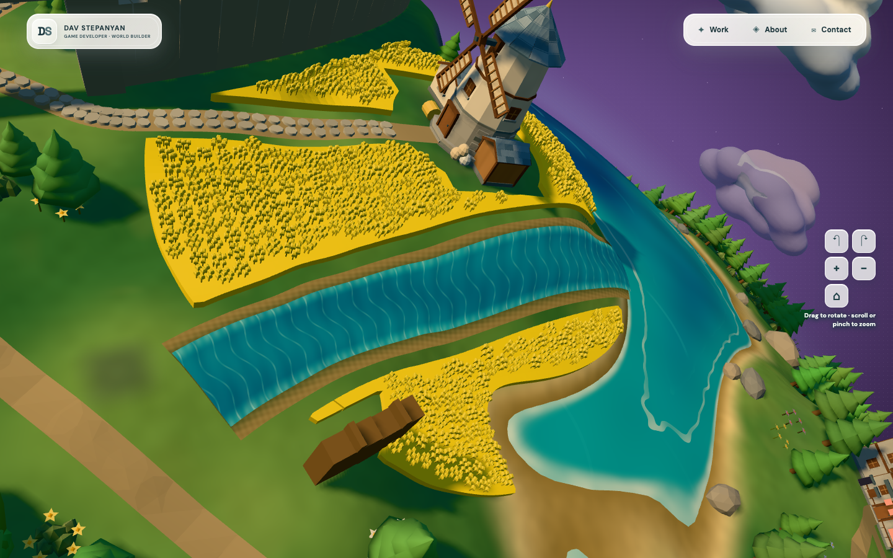

# Graphics and performance — September 30, 2026

The planet now has stronger light and shadow contrast, reflective ocean swells, moving shoreline foam, layered river flow, wet banks, and clearer meadow, cliff and snow materials. Desktop shadows use **75% fewer map texels** after the optimization pass. Local Chrome retains the configured desktop 60 Hz and mobile-layout 30 Hz render cadence. GPU timing varies substantially, so this report does not claim a universal FPS increase or physical-phone performance.

## Changes

- Lighting uses a warmer key and cooler, lower sky fill. Weather and moonlight now affect the final planet lighting and shared atmosphere uniforms; a previous per-frame override erased those changes. Shadow bias stays below one texel, preserving contact, and the depth volume covers the mountains and tall project landmarks.
- Ocean shading combines continuous analytical swell and chop normals, depth-dependent roughness, drifting wave strokes and broken shoreline foam. River shading adds downstream flow, surface-normal detail, shallow edges, dark channels and damp banks. Detail fades when smaller than a pixel. Reduced motion freezes water animation. These changes add no water geometry, textures, noise octaves or render passes.
- Terrain uses varied roughness, wet sand, subtle derivative-based relief and less grain shimmer. One noise evaluation was removed. A thinner atmosphere follows sunlight and moonlight; its mesh uses 8,128 fewer triangles.
- Optimization changes desktop shadows from 4096² to 2048², retaining 1024² on mobile. Frozen close views at both resolutions were inspected; finer foliage shadow edges soften slightly at 2048, while building contacts and relief remain readable.
- Stable grove levels skip redundant material updates; the grove origin and range array initialize once. Projected world positions are reused by the vertex and shadow-coordinate paths. Stationary project labels skip identical position writes; browser observers recorded zero label style mutations over two seconds in both layouts.

## Measurement

Three five-second windows were collected for each of opening, completed-beacon and damaged-world saves, in desktop and mobile layouts, at three source stages: original, graphics upgrade, and optimized upgrade. Save orders and ending outcomes were verified. Decorative motion was enabled for these 54 windows. CPU profiles ran separately. No builds or tests overlapped these timing windows.

Values below are the median of three window p95 values, in milliseconds. Each cell is **full frame callback CPU / GPU render query**. GPU queries use `EXT_disjoint_timer_query_webgl2` around renderer submission, including shadow rendering; unavailable or disjoint results are excluded. These are render diagnostics, not presentation latency.

| Layout / world | Original | Graphics | Optimized |
| --- | ---: | ---: | ---: |
| Desktop opening | 1.20 / 2.05 | 1.40 / 2.80 | 1.20 / 2.35 |
| Desktop beacon | 3.40 / 3.30 | 3.40 / 3.45 | 3.40 / 3.21 |
| Desktop damage | 3.30 / 3.41 | 3.20 / 3.32 | 3.00 / 2.86 |
| Mobile layout opening | 3.50 / 1.91 | 3.50 / 2.44 | 3.20 / 1.80 |
| Mobile layout beacon | 3.70 / 2.41 | 3.70 / 2.61 | 3.70 / 2.04 |
| Mobile layout damage | 3.30 / 3.20 | 3.60 / 3.48 | 3.60 / 2.70 |

All window render-interval p95 values remain approximately 16.7–16.8 ms desktop and 33.4 ms mobile layout. The initial desktop optimization comparison shows 7–16% lower GPU p95, but separate sessions, animation and host activity prevent attributing all of that change to the optimization. Mobile shadows keep the same resolution; its timing variation likewise must not be treated as a shadow-resolution saving.

A longer alternating 4096/2048 run exposed increasing GPU timing over time, including unchanged 4096 controls. Its raw results are retained as exploratory evidence in `shadow-compare.json.gz`; they do not establish a robust percentage improvement. A separate eight-window repeat freezes decorative animation and holds all 494 draws and 2,702,933 triangles constant. It also shows large timing drift, reaching roughly 11 ms GPU p95 for both resolutions. The late 4096 controls report 11.23 and 11.20 ms; the late 2048 controls report 11.19 and 10.80 ms. This repeat does **not** confirm the initial 7–16% saving. `shadow-static.json.gz` retains the complete repeat. The reliable optimization result is reduced shadow-map footprint, with visually acceptable softer fine shadows, rather than an established FPS gain.

## Verification and limits

TypeScript and all **199 tests pass**. The production build passes. Both production layouts restore the completed world, initialize WebGL, open Selected Work, expose no development debug object and report no console or uncaught errors; `evidence/production-smoke.json` retains the checks. These cold localhost smoke runs took about 5.4–5.7 seconds including the deliberate 1.5-second settle and panel opening, so they are functional checks rather than loading benchmarks. Its existing large-bundle warning remains: 17.20 MB raw JavaScript, 1.89 MB estimated gzip, predominantly embedded geometry. This pass changes rendering, not asset loading.

Both layouts compile the terrain, ocean, river and projected-shadow shaders without console or uncaught errors. Active rivers render all 2,304 surface vertices. Work, About and Contact panels open in both layouts. Clear, overcast and moonlit screenshots verify light modulation: sun intensity is 3.10, 2.525 and 0.837 respectively. Six restart cycles exercise 60 choices and skip/cancellation, restore the beacon ending, and retain stable resource counts: 1,754 scene objects, 631 projected depth materials, 295 geometries and seven textures. Reload preserves progress. A separate two-minute soak checks cadence and retained resources.

This is an unreleased working-tree comparison; prior user changes were preserved. Chrome 154.0.8037.58 uses ANGLE Metal on Apple M3 Max. Desktop viewport is 1440×900 at DPR 1. Mobile viewport is 390×844 at browser DPR 2, game DPR 1.5. Neither emulated mobile layout nor the two-minute soak establishes sustained physical-phone acceptance. Background suspension remains unverified because headless Chrome does not expose the hidden-tab transition.

The soak has 12 observations, all at render-interval p99 16.8 ms, with seven textures and 277–278 geometries after reload. Final collected heap is 58.82 MiB; its reloaded session differs from the warmed restart-cycle session. No uncaught errors occurred. This is a bounded retention diagnostic, not proof of long-term leak freedom.

## Evidence and reproduction

[Metrics](metrics.json) retain per-window summaries. `evidence/*.json.gz` retain raw frame, span and GPU samples; CPU profiles, screenshots, smoke results and check/build logs remain alongside them. [Source identity](source-identity.json) records every TypeScript source hash at all three stages. Frozen rendering modules are retained in `evidence/source/baseline` and `evidence/source/visual`; compare them against the working implementation to distinguish new graphics edits from pre-existing work.

Run `npm run dev -- --port 5173`, then `node scripts/graphics-performance.mjs /tmp/town-graphics current http://127.0.0.1:5173`. `TOWN_FIXTURE`, `TOWN_LAYOUT`, `TOWN_SAMPLE_MS` and `TOWN_CPU_PROFILE` select focused runs. Use `TOWN_SHADOW_COMPARE=1 TOWN_STATIC_COMPARE=1 TOWN_FIXTURE=beacon TOWN_LAYOUT=desktop` for alternating frozen-animation shadow controls. Run `node scripts/graphics-smoke.mjs /tmp/town-graphics` and `node scripts/performance-lifecycle.mjs /tmp/town-graphics/lifecycle` after timing. The harness uses bundled Playwright and installed Chrome and adds no production instrumentation.
