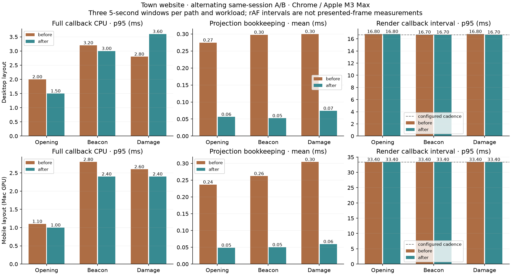
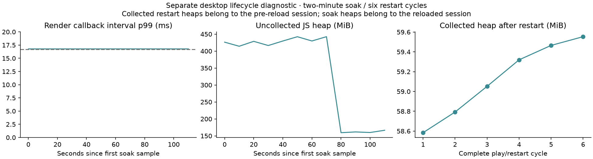

# Town performance and optimization — September 30, 2026

The planet projection's repeated bookkeeping costs **75–82% less CPU** across six representative desktop/mobile-layout workloads. Six frozen before/after screenshots match pixel-for-pixel and byte-for-byte. Whole-frame CPU results are mixed, so this pass establishes a narrower CPU improvement, not a universal FPS increase.

The website keeps its existing 60 FPS desktop and 30 FPS mobile settings. The measured render-callback intervals remain near those configured cadences. These are browser diagnostics on an Apple M3 Max, not presented-frame or physical-phone acceptance measurements.

## Changes and causes

1. `PlanetProjection.sync` traversed every scene node, allocated a presence set and single-material arrays, and searched depth-material ownership on every rendered frame. It now observes child additions/removals, rebuilds its retained drawable list once after hierarchy changes, and checks material replacements against that list. Removing objects releases their depth materials and hierarchy observers. Reattaching pooled objects prepares them before rendering. Stable frames avoid a full traversal.
2. The flat-world land and environment branches were permanently invisible in planet mode but still participated in renderer matrix traversal. They now remain outside the planet scene. Their placement and simulation data stay available. The original valley mode follows its existing path.

Shader projection, terrain resolution, authored models, shadows, animation rates, gameplay, saves, and frame caps retain their existing behavior. The cached topology introduces two listeners per observed object; the six-cycle retention check confirms their owning object count reaches a stable plateau.

Rendering remains the largest measured CPU cost. A completed scene submits roughly 400–500 draws and 1.3–2.7 million triangles, depending on layout and event state. Those are diagnostic counts, not automatic failures. This pass makes no geometry or artwork reduction.

## Controlled comparison

The frozen pre-change projection implementation is retained in [projection-before.ts](evidence/projection-before.ts). The harness switches the two changed paths in the same browser session: baseline traversal with hidden branches attached, or cached traversal with those branches detached. Both use the same actual game state, renderer, geometry, camera, device scale, and GPU.

Each of six workloads has two adjacent A/A windows, then three alternating A/B pairs in AB/BA/AB order. Windows are five seconds, after four seconds of warmup; the hierarchy switch gets an additional 350 ms before collection. There were 48 windows in total, including 12 A/A controls. Instrumentation wraps the same functions in both paths and resets its buffers per window. CDP CPU profiles and garbage collection run separately from frame comparison windows.

Fixtures are restored before the game module loads, then checked against the actual game state. The beacon fixture must finish with a lit beacon. The damage fixture must finish with a departed dragon and an overflowed volcano. Initial exploratory measurements that failed fixture validation were excluded. A preliminary alternate order also reached the safe ending and was not retained as damage evidence.

Values below are the median of three per-window statistics, not pooled samples across devices or layouts. All quantities are milliseconds.

| Layout / fixture | Projection mean before → after | Reduction | Full callback CPU p95 before → after | Render interval p95 before → after |
| --- | --- | --- | --- | --- |
| Desktop opening | 0.275 → 0.056 | 79.5% | 2.00 → 1.50 | 16.8 → 16.8 |
| Desktop beacon | 0.298 → 0.052 | 82.4% | 3.20 → 3.00 | 16.7 → 16.7 |
| Desktop damage | 0.300 → 0.074 | 75.3% | 2.80 → 3.60 | 16.8 → 16.7 |
| Mobile layout opening | 0.237 → 0.049 | 79.4% | 1.10 → 1.00 | 33.4 → 33.4 |
| Mobile layout beacon | 0.262 → 0.050 | 80.9% | 2.80 → 2.40 | 33.4 → 33.4 |
| Mobile layout damage | 0.304 → 0.059 | 80.5% | 2.60 → 2.40 | 33.4 → 33.4 |

The first desktop damage comparison has a **28.6% higher full-callback p95**, even as its projection cost falls. Submission time changes substantially across windows, and normal user host activity was not controlled. Its paired samples do not establish a universal improvement or a confirmed source regression. A longer focused repeat is retained separately below; the first result is preserved rather than replaced.

The [focused desktop damage repeat](damage-repeat/metrics.json) used ten-second windows after ten seconds of warmup. Projection mean fell **0.300 → 0.052 ms (82.6%)** and full-callback CPU p95 fell **3.10 → 2.80 ms (9.7%)**. The earlier increase did not reproduce. A/A p95 was 3.9 and 3.8 ms; later baseline windows settled around 3.1 ms, reinforcing the need to keep variability and rendering/submission effects separate. Its [raw samples](damage-repeat/evidence/measurements.json.gz) and [graph](damage-repeat/graphs/comparison.png) remain separate from the first six-workload run. The repeat's screenshot pair also matches exactly.

## Visual and lifecycle verification

All six screenshot pairs have zero changed pixels at 1440×900 or 780×1688 capture resolution. Decorative time is fixed and reduced motion enabled only for the visual comparisons; the timing windows use normal motion. Matching PNG SHA-256 hashes are recorded in [metrics.json](metrics.json); one shared PNG per identical pair is retained in `evidence/`.

Six restart cycles exercised all ten actual choices and their skip/cancellation paths: 60 choices total. Each cycle reached the deterministic beacon ending. Counts remained identical in every settled cycle: 1,754 scene/observer objects, 631 projected depth materials, 295 renderer geometries, and seven textures. The latter includes bounded effect resources warmed by gameplay, so it is not the same fixture as loading an already completed save.

Collected JavaScript heap after each cycle was 58.58, 58.79, 59.05, 59.32, 59.46, and 59.55 MiB. That is 0.97 MiB growth across six cycles, with no renderer-resource growth. This short sample is not proof of long-term leak freedom.

Reload preserved all ten decisions and the lit beacon. Work, About, Contact, and the Wizard project panel opened correctly across three rounds (12 openings). Automation completion times are retained as functional evidence, not tap-to-paint latency.

A separate two-minute completed-world desktop soak retained seven textures and stable geometry counts, with body-profile render interval p99 at 16.8 ms for all 12 observations. No uncaught errors occurred. Its final collected heap was 58.82 MiB in the reloaded session; it is not directly comparable to the pre-reload cycle heap. Raw data is in [lifecycle.json](evidence/lifecycle.json).

The uncollected `performance.memory.usedJSHeapSize` counter ranged from 159.37 to 442.53 MiB before normal collection. Collected heap figures use CDP `Runtime.getHeapUsage.usedSize`; its backing-storage count was approximately 99 MiB separately. These counters have different accounting and are not additive total-memory estimates. The large temporary footprint and embedded geometry remain memory/loading costs to investigate on physical mobile hardware.

## Coverage and remaining measurements

| Area | Result | Evidence / next measurement |
| --- | --- | --- |
| Opening, prepared ending, damaged ending | Executed in both layouts | 6/6 workloads; restored order and event outcomes verified |
| Cached topology and material replacements | Passed | Regression tests cover stable frames, nested additions/removals, reattachment, material-array edits, native/shader exclusions, and disposal |
| Visual preservation | Passed | 6/6 identical PNG pairs |
| All choices, restart, skip, reload | Passed | 60 choices, six restart cycles, restored beacon |
| Portfolio panels | Passed functional checks | 12 actual openings; visible panel/title recorded |
| Retention | Short diagnostic passed | Resource counts plateau; six collected heaps and two-minute soak |
| Background suspension | Unverified by runtime | Headless Chrome kept `document.hidden=false` after foreground-tab switching; repeat with a headed browser and verify hidden/resume counters |
| Presented frames and GPU execution | Unmeasured | Capture presentation traces / GPU timing separately; rAF intervals and submission CPU do not establish GPU completion |
| Physical mobile performance | Unmeasured | Repeat on actual phone hardware; mobile viewport here uses the Mac GPU |
| Production boot / asset transfer | Local smoke only | Fresh-context production readiness was 2.263 s desktop and 2.014 s mobile layout on localhost; one sample each, no network throttle or hosted compression measurement |
| Long sustained acceptance | Not executed | The executed soak is two minutes; a 30-minute hardware run remains separate |
| Backend / hosted consumption | Not applicable | This site has local saves and static hosting, with no game backend workload |

## Identity, evidence, and reproduction

This is unreleased dirty source based on commit `b642df5eaca2f8734690c000e5601b60e7c5bfb7`. Existing user changes were preserved. It is not a comparison between published releases. There was no earlier comparable website run; Idle Wizard's optimization notes supplied the measurement method, not phone budgets or historical numbers.

Chrome 154.0.8037.58 uses ANGLE Metal on Apple M3 Max, macOS 26.0.1, model Mac15,11, 36 GiB RAM. Desktop viewport is 1440×900 at DPR 1. Mobile viewport is 390×844 at browser DPR 2, with the game capped to DPR 1.5 and a 585×1266 canvas. All source files, including previously untracked event modules and generated geometry, have SHA-256 identities in [metadata.json](metadata.json).

The complete window samples are retained losslessly in [measurements.json.gz](evidence/measurements.json.gz). Separate [before](evidence/beacon-before.cpuprofile) and [after](evidence/beacon-after.cpuprofile) profiles identify expensive code but are not added together as savings. Summary [metrics](metrics.json), screenshots, and graphs remain versioned with this report.

Run `npm run dev -- --port 5173`, then `node scripts/performance-pass.mjs /tmp/town-performance` and `node scripts/performance-lifecycle.mjs /tmp/town-lifecycle`. The scripts use the bundled Playwright runtime and installed Chrome; `TOWN_PLAYWRIGHT_PATH` and `TOWN_BROWSER_CHANNEL` select alternatives. The report generator requires Pillow and matplotlib. No instrumentation is added to the production bundle by these scripts.

Validation: TypeScript and all 196 existing/new tests passed. `npm run build` passed. Both production layouts initialized WebGL, opened Selected Work, exposed no development debug object, and reported no uncaught errors; [production smoke evidence](evidence/production-smoke.json) retains actual local resource byte counts.

The production JavaScript still contains substantial embedded geometry: **17.19 MB raw, 1.89 MB estimated gzip**, with Vite's large-chunk warning. This pass does not reduce that payload. A separate loading optimization should measure cold hosted transfer/parse time before choosing staged geometry loading or binary assets. The current local smoke times do not establish cellular-network readiness.
